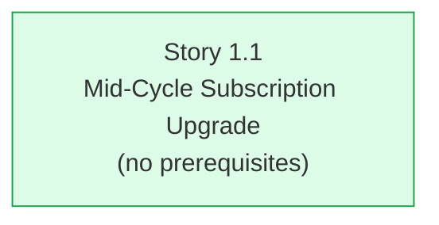

# aire State Tracking

## Project Information
- **Project Type**: Brownfield
- **Start Date**: 2026-08-31T11:07:03Z
- **Current Stage**: 🛑 HALTED — Design complete — awaiting `dev-implement`
- **AIRE Version**: 1.0
- **Workflow Type**: Epic

## Workspace State
- **Existing Code**: Yes
- **Programming Languages**: Python (FastAPI backend), JavaScript/JSX (React 19 frontend), CSS, HTML
- **Build System**: npm + Vite 8 (frontend); pip / requirements.txt (backend)
- **Project Structure**: Full-stack monolith (POC) — single FastAPI module + React SPA
- **Workspace Root**: C:/Users/shailendra.yadav/Desktop/projects/helix-aire-v1-demo2
- **Reverse Engineering Needed**: No — Atlas full coverage (see Existing-System Context)
- **Reverse Engineering Artifacts**: .spec/aire-docs/planning/reverse-engineering/

## Code Root
- **Backend**: src/backend/ (FastAPI — main.py, requirements.txt)
- **Frontend**: src/frontend/ (React 19 + Vite SPA)
- **Note**: At Workspace Detection the frontend sat at repo-root `frontend/`, outside `src/`, and was
  recorded as such with no intention to move it. It was **relocated to `src/frontend/` externally,
  mid-cycle** (detected at the STOP CHECKPOINT, before any code was generated). The move was complete
  and clean: all 19 tracked files byte-identical, `src/backend/main.py` untouched. AIRE did not perform
  the move; it adopted it, since `src/` is where `common/directory-structure.md` requires application
  code to live. The rename is staged in git as 19 renames. Every artifact path was corrected, and
  finding F-4 is resolved as a side effect.
- **Recorded**: 2026-08-31T11:07:03Z
- **Code Root revised**: 2026-08-31T12:35:00Z (frontend relocation adopted)

## Code Location Rules
- **Application Code**: src/backend/ and src/frontend/ (NEVER in .spec/aire-docs/)
- **Documentation**: .spec/ only
- **Tests**: tests/unit/, tests/behavior/, tests/e2e/

## Helix MCP Binding
- **Server**: helix
- **Graph tool(s)**: mcp__helix__codebase_agent_query — natural-language codebase graph queries; mcp__helix__codebase_cypher_query — direct Cypher; mcp__helix__graph_change_impact — change-impact analysis
- **Docs tool(s)**: mcp__helix__list_solution_documents_tool, mcp__helix__get_solution_document_tool — list/fetch Atlas solution documents; mcp__helix__document_chatbot_query — NL query over docs
- **Search tool(s)**: mcp__helix__document_chatbot_query, mcp__helix__platform_docs_query
- **Estate / workspace id**: solution_id 874 — "Billing-Cycle-AIRE-V1-Demo"; repository Billing-Cycle (https://github.com/Shailendrayadav0666/Billing-Cycle), branch main, last ingested commit bcec649e08f2dbec435c24066deae6a1d6d71192
- **Resolved**: 2026-08-31T11:07:03Z

## Existing-System Context
- **Workspace type**: brownfield
- **Helix MCP**: connected
- **Source**: atlas
- **Components in scope**: backend (FastAPI main.py), frontend Billing page (Billing.jsx), frontend AuthContext.jsx, frontend App.jsx
- **Atlas coverage**: 8 of 8 components covered by the "Deep Dive: Billing-Cycle" document (id 3155, v28, CURRENT)
- **Knowledge graph**: .spec/aire-docs/planning/reverse-engineering/knowledge-graph.md
- **Recorded**: 2026-08-31T11:07:03Z

## Tracker
- Type: LOCAL
- Parent Epic: EPIC-1 (locally minted — Epic sourced from Atlas document 3157, not from an external tracker)
- Epic URL: -
- Project Key / Repo / Org: -
- Note: LOCAL mode. Zero external tracker calls, ever. The Story Tracker in this file is authoritative.

## Branching
- Base Branch: main
- Epic Branch: epic/EPIC-1-mid-cycle-subscription-upgrade
- Epic PR: (not raised - raised manually at cycle end via pr-generator)

## Context Project
- **Existing Knowledge**: No
- **Existing Knowledge Path(s)**: -
- **New References**: No
- **New Reference Path(s)**: -
- **Note**: User answered "no" to both parts. Existing-system knowledge comes from Atlas instead.

## Design References
| Reference | Type | Registered At Stage | Read? | Read At Stage |
|---|---|---|---|---|
| Atlas document 3157 (Epic: Mid-Cycle Subscription Upgrade) | Solution document (epic) | Workspace Detection | Yes | Workspace Detection |
| Atlas document 3155 (Deep Dive: Billing-Cycle) | Solution document (deepdive) | Workspace Detection | Yes | Workspace Detection |

### Reconciliations
| Point | Reference says | Decision taken | Why |
|---|---|---|---|
| Repo layout | `backend/` + `frontend/` at repo root | Mapped to `src/backend/` + `src/frontend/` | Atlas describes the upstream Billing-Cycle repo; this workspace is an AIRE-restructured copy. Atlas remains the truth for architecture and contracts; only paths are remapped. The frontend half of this mapping changed mid-cycle when the tree was relocated from `frontend/` to `src/frontend/` — see `## Code Root`. |
| `renew_at` value | Hardcoded string "Sep 09, 2025" | Treated as dynamic (`today + 30 days`) | Verified in `src/backend/main.py` lines 27, 35, 125, 130 - `renew_at` is computed at runtime. The Epic's "$10.00 at 15 days" is an illustrative example, not a fixture. |

## Story Tracker
| Story | Title | Requires | Tracker ID | Status | PR | Merged | Start | End | Recorded |
|---|---|---|---|---|---|---|---|---|---|
| 1.1 | Mid-Cycle Subscription Upgrade (Standard to Premium) | none | LOCAL | 🟢 Ready for Development | - | - | - | - | 2026-08-31T11:55:34Z |

## Dependency Graph
Generated automatically (no approval gate) - `.spec/aire-docs/planning/dependency-graph.yml`

**Inferred edges**: none. With `target_story_count = 1` there is no second story for an edge to
point at, so nothing was inferred and nothing is blocked.

**Ready-stories summary**
| Story | Requires | Startable now | Blocked by |
|---|---|---|---|
| 1.1 | none | Yes | - |

- Total stories: 1
- Immediately startable: 1
- team_size: 2
- **R5 parallelism target NOT met** - only one story exists, so fewer than `team_size` independent
  stories are available. This follows directly from the accepted story-sizing deviation above; it is
  not an inference error. The second developer's capacity is available for the parallel **ve track**
  (`/ve-implement 1.1`), which needs no dev branch, PR or merge and can start immediately.
- **shared_files**: none. A single story has no cross-story merge-conflict surface.
- Files in scope for the baseline capture: `src/backend/main.py`, `src/frontend/src/pages/Billing.jsx`

## Team Configuration
- team_size: 2 (fixed default - never asked)
- story_creation_mode: all-at-once (fixed default - never asked)
- target_story_count: 1 (USER OVERRIDE of the recommended 10, explicitly confirmed after the full trade-off was presented - see audit.md Entries 10-11)

### Accepted deviation - story sizing
The single story breaches the Step 1.5 hard sizing ceilings by design, at the user's explicit
direction: 31 acceptance criteria against a ceiling of 5; both architectural layers newly touched;
all four scenario classes in one story; parallelism rule broken (1 story < team_size 2). Step 18.6
would normally split the story here - it is NOT run in split mode, because the user was shown each
of these consequences and chose this shape anyway. Recorded rather than silently corrected.

## Extension Configuration
| Extension | Enabled | Source |
|---|---|---|
| Security Baseline | Yes (ALWAYS mandatory) | extensions/security/baseline/security-baseline.md |
| Playwright Test Automation | Yes (ALWAYS mandatory) | extensions/testing/playwright-automation/playwright-automation.md |
| Resiliency Baseline | No (user declined) | extensions/resiliency/baseline/resiliency-baseline.opt-in.md |
| Property-Based Testing | No (user declined) | extensions/testing/property-based/property-based-testing.opt-in.md |

## Stage Progress
- [x] Workspace Detection — COMPLETE
- [x] Reverse Engineering — SKIPPED (Atlas full coverage, Source: atlas)
- [x] Requirements Analysis — COMPLETE (approved, committed 7093b85, pushed)
- [x] User Stories — COMPLETE (GATE 1 approved; Part 3 no-op, LOCAL)
- [x] Dependency Graph — COMPLETE (auto-approved)
- [x] Workflow Planning — COMPLETE (auto-approved)
- [x] Application Design — SKIPPED (no new components/services; the needed method + business-rule definition moves to Functional Design)

### 🟢 IMPLEMENTATION PHASE
- [x] Functional Design — COMPLETE (Standard depth, approved; D-1/D-2/D-3 resolved)
- [x] NFR Requirements — COMPLETE (Minimal depth, approved)
- [x] NFR Design — COMPLETE (Minimal depth, approved; P-1..P-7 defined)
- [x] Infrastructure Design — SKIPPED (zero infrastructure delta)
- [x] architecture.md v1.0.0 + rubrics + CI pipeline — COMPLETE (dry-run verified)
- [x] 🛑 STOP — **Design complete — awaiting dev-implement** (handoff presented at commit 5b0dddc)
