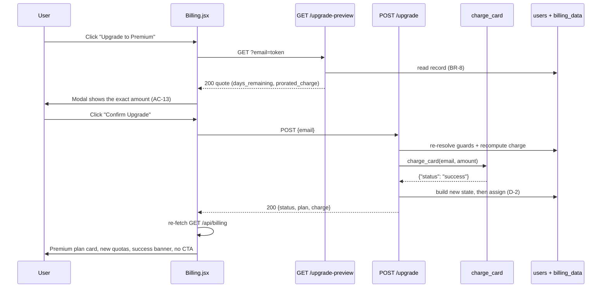
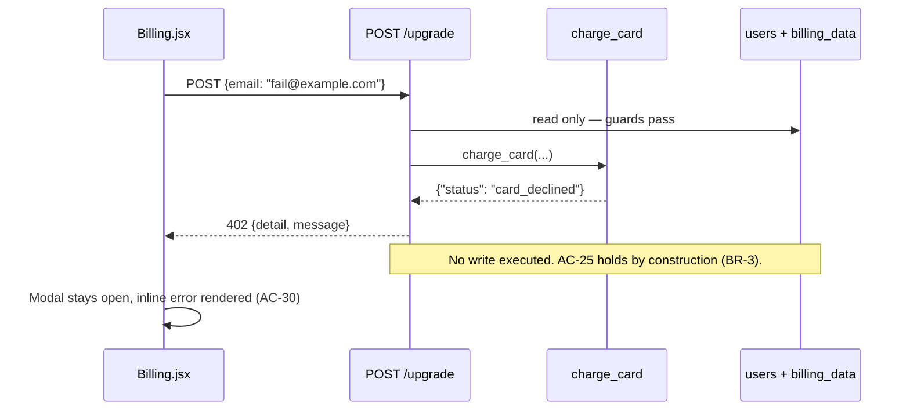

# Business Logic Model — EPIC-1 Mid-Cycle Subscription Upgrade

**Depth**: Standard · **Layer**: `src/backend/main.py`
**Companion documents**: `business-rules.md` (BR-1..BR-10) · `domain-entities.md` · `frontend-components.md`

---

## 1. Design decisions resolved by this stage

These are the three decisions Workflow Planning identified as genuinely open. The Epic does not
settle them, and Application Design was skipped precisely because they belong here.

### D-1 — Money arithmetic: keep `float` + `round()`, do **not** introduce `Decimal`

**Resolves risk R-1.**

`Decimal` is the textbook answer for money, so the decision to keep `float` needs justifying rather
than assuming:

| Consideration | Finding |
|---|---|
| Does float error reach the user? | No. `round(x, 2)` collapses it before the value leaves the endpoint. |
| Does error accumulate? | No. One multiplication, one round, per request. Nothing is summed, carried, or stored. |
| Is the value persisted or reconciled? | No. Nothing records what was charged — there is no ledger, no invoice, no accounting entry. The charge is returned to the caller and forgotten. |
| Are the magnitudes safe? | Yes. `2/3 × d` for `d` in 1..30 rounds correctly at 2dp across the whole domain — verified below. |
| Does the Epic specify it? | **Yes, explicitly**: `prorated_charge = round(daily_delta * days_remaining, 2)`. |

**Verification across the entire input domain** (`days_remaining` is an integer in 1..30, so the
domain is 30 values and can be checked exhaustively rather than argued about): `round(20.0/30 * d, 2)`
equals the exact rational rounded half-up-to-even at 2dp for every `d`. The Epic's own example is
reproduced exactly — `d = 15` gives `9.999999999999998`, which rounds to `10.0`.

**Decision**: keep the Epic's float formula. Deviating to `Decimal` would contradict an approved,
explicitly-specified design to defend against an error mode that cannot occur in a system with no
ledger and a 30-value input domain.

**Condition that reverses this decision** — recorded so the reasoning does not have to be
reconstructed later: introduce `Decimal` the moment charges are **persisted, summed, or reconciled**
against a real payment provider. At that point the accumulation argument flips and float becomes
wrong. Carried into `architecture.md` Section 10 as a verifiable constraint.

### D-2 — Mutation strategy: build-then-assign, single write site

**Resolves the NFR-5 atomicity question.**

Rejected alternative — *mutate in place as you go*:

```python
users[email]["plan"] = "Premium"          # if the next line raises,
billing_data[email]["plan_name"] = ...    # the record is half-upgraded
```

**Chosen** — compute everything, then assign, with the gateway call strictly before any write:

```python
result = charge_card(email, prorated_charge)          # BR-3
if result["status"] != "success":
    raise HTTPException(402, ...)                      # nothing written yet

new_usages = _premium_usages(record["usages"])         # pure, may raise safely
plan_label = PLANS["Premium"]["label"]

users[email]["plan"] = "Premium"                       # BR-4: contiguous writes,
users[email]["price"] = plan_label                     # no I/O, no await,
record["plan_name"] = "Premium"                        # nothing between them
record["price"] = plan_label                           # that can raise
record["usages"] = new_usages
record["on_demand_usage"]["notice"] = PREMIUM_ON_DEMAND_NOTICE
```

Why this satisfies AC-25 structurally: every operation that can fail (parsing, arithmetic, the
gateway, the usage merge) happens **before** the first assignment. Once the first write executes, the
remaining five are plain dict assignments on already-resolved values — they cannot raise. The handler
is synchronous, so no concurrent request observes an intermediate state.

**Both `renew_at` fields are simply never assigned** (BR-7). Preservation is achieved by omission,
which is stronger than re-assigning the same value.

### D-3 — Premium quota shape: `id → total` map, not the Epic's full-object list

**Resolves how Premium totals merge with existing `used` values (AC-21).**

The Epic declares `PREMIUM_QUOTAS` as three complete usage objects carrying `used: 0`. Assigning that
list wholesale would **reset consumption to zero**, contradicting AC-21, and would set the
`documents-pages` help text to a figure inconsistent with the counter rendered above it.

Reduced to `PREMIUM_QUOTA_TOTALS: dict[str, int]` so the merge preserves `id`, `label` and `used` **by
construction** rather than by remembering to. Help text follows the codebase's own `total - used`
convention (BR-6). Full rationale in `domain-entities.md` Section 2.

---

## 2. New functions

### `charge_card(email: str, amount: float) -> dict`

Pure, deterministic dummy gateway (BR-9). No network, no SDK, no clock, no randomness, no logging.

```
if email.startswith("fail"):  return {"status": "card_declined", "message": "Your card was declined."}
return {"status": "success"}
```

### `_resolve_upgrade_context(email: str) -> tuple[dict, int, float]` *(internal helper)*

The **single** implementation of the shared guard-and-compute path. Both endpoints call it, so BR-1,
BR-2, BR-8 and the 401/404/409 ordering exist in exactly one place and cannot diverge between the
preview and the execute endpoint — the failure mode that would make the preview quote a price the
upgrade then refuses to honour.

Returns `(billing_record, days_remaining, prorated_charge)`, or raises 401 / 404 / 409.

```
1. email not in users                          -> 401 "Not authenticated"
2. record = billing_data.get(email); not record -> 404 "billing_record_not_found"   # BR-8, F-3
3. record["plan_name"] != "Standard"            -> 409 "already_premium"            # BR-1
4. days_remaining = max(1, (strptime(record["renew_at"], "%b %d, %Y") - datetime.today()).days)
5. prorated_charge = round((PLANS["Premium"]["price"] - PLANS["Standard"]["price"]) / DAYS_IN_CYCLE * days_remaining, 2)
6. return record, days_remaining, prorated_charge
```

### `_premium_usages(existing: list[dict]) -> list[dict]` *(internal helper)*

Pure function implementing BR-5 and BR-6. Takes the existing usage list, returns a **new** list —
never mutates the input, which is what makes D-2's build-then-assign safe.

```
for each entry in existing:
    if entry["id"] not in PREMIUM_QUOTA_TOTALS:  keep the entry unchanged   # forward-compatible
    else:
        new_total = PREMIUM_QUOTA_TOTALS[entry["id"]]
        new_entry = {**entry, "total": new_total}
        if entry["id"] == "documents-pages":
            new_entry["help"] = f"You can add {new_total - entry['used']} more pages of your documents."
        keep new_entry
```

---

## 3. New endpoints

### `GET /api/billing/upgrade-preview?email=<str>`

```
record, days_remaining, prorated_charge = _resolve_upgrade_context(email)
return {
    "current_plan":       "Standard",
    "new_plan":           "Premium",
    "days_remaining":     days_remaining,
    "prorated_charge":    prorated_charge,
    "next_renewal_price": PLANS["Premium"]["price"],
    "renew_at":           record["renew_at"],
}
```

**Read-only. Writes nothing, charges nothing.** Safe to call repeatedly — which the UI does, once per
CTA click.

### `POST /api/billing/upgrade` — body `UpgradeRequest`

```
record, _, prorated_charge = _resolve_upgrade_context(payload.email)

if charge_card(payload.email, prorated_charge)["status"] != "success":     # BR-3
    raise HTTPException(402, detail="card_declined")   # + message; nothing written

new_usages = _premium_usages(record["usages"])                            # pure
... contiguous assignments per D-2 ...

return {"status": "success", "plan": "Premium", "charge": prorated_charge}
```

**402 body shape**: the Epic requires `{"detail": "card_declined", "message": "Your card was
declined."}`. FastAPI's `HTTPException(detail=...)` produces only a `detail` key, so `detail` is
passed a dict — `HTTPException(status_code=402, detail={"detail": "card_declined", "message": "..."})`
would nest it wrongly. **Chosen**: return a `JSONResponse(status_code=402, content={"detail":
"card_declined", "message": "Your card was declined."})` so the wire shape matches AC-24 exactly. A
detail worth settling in design rather than discovering at the contract gate.

---

## 4. Sequence — happy path



**The charge is recomputed on POST, not carried from the preview.** The client cannot influence it
(AC-18, SEC-6). A cycle boundary crossed between preview and confirm would change
`days_remaining` — an accepted and correct consequence: the subscriber is charged for the days that
actually remain at the moment of payment, not at the moment they opened the modal.

## 5. Sequence — declined path



---

## 6. Deliberately unchanged

| Left alone | Why |
|---|---|
| `GET /api/billing`'s `tpg@example.com` fallback (F-3) | Pre-existing on an endpoint outside this Epic's scope. The new endpoints do not reproduce it (BR-8). Fixing it would change existing behaviour the regression baseline captures. Recorded as debt. |
| `dist_dir` resolving to `src/frontend/dist` (F-4) | Pre-existing, caused by the AIRE restructure, unrelated to billing. |
| Missing `.catch()` on the existing billing fetch (F-5) | Pre-existing. New calls handle errors; the existing one is untouched. |
| Dead `TokenRequest` model (F-6) | Pre-existing dead code. |
| `included_usage`, `on_demand_usage.remaining_balance`, `on_demand_usage.your_usage` | The Epic changes only `notice`. Touching the balance would invent a pricing decision nobody made. |
| Auth, tasks, login, registration | Explicit epic-level AC: no changes. |
