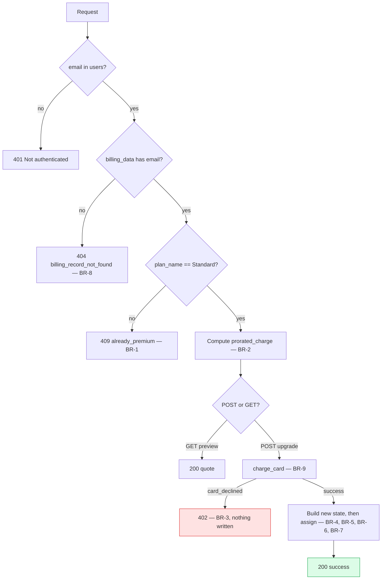

# Business Rules — EPIC-1 Mid-Cycle Subscription Upgrade

**Depth**: Standard · Every rule traces to an AC in `stories.md` and a requirement in `requirements.md`.

---

## BR-1 — Upgrade eligibility

> A subscriber may upgrade **if and only if** their `billing_data[email]["plan_name"]` is exactly
> `"Standard"`.

- `"Premium"` → **409 `already_premium`** on both endpoints (AC-10, AC-11)
- Any other value → treated as **not eligible**, answered 409. The plan ladder has exactly two rungs (assumption A-2); an unrecognised plan is not silently upgraded.
- The check reads `billing_data`, **not** `users["plan"]`. Both hold a plan and could drift (no referential integrity); `billing_data` is what `GET /api/billing` serves and what the UI renders, so it is authoritative for eligibility.

*Traces*: FR-2, FR-9 → AC-3, AC-4, AC-10, AC-11

---

## BR-2 — Proration

> The subscriber pays only for the days remaining in the cycle, at the **difference** between the two
> plan prices — never the full Premium price.

```
days_remaining  = max(1, (strptime(renew_at, "%b %d, %Y") - datetime.today()).days)
daily_delta     = (PLANS["Premium"]["price"] - PLANS["Standard"]["price"]) / DAYS_IN_CYCLE
prorated_charge = round(daily_delta * days_remaining, 2)
```

**Invariants** (asserted as tests per NFR-4, never a literal amount):

| Invariant | Why |
|---|---|
| `days_remaining >= 1` | The `max(1, ...)` floor. A cycle ending today still costs one day, never zero or negative. |
| `0 < prorated_charge <= 20.00` | The delta is $20/cycle; 30 days of it is the ceiling, 1 day the floor ($0.67). |
| `prorated_charge == round(2/3 * days_remaining, 2)` | The formula itself, since `20/30 = 2/3`. |
| Charging is **idempotent-by-guard**, not idempotent-by-nature | A second call is refused by BR-1's 409, so no double charge is possible. |

**Known behaviour, not a defect (finding F-2)**: `renew_at` parses to midnight while
`datetime.today()` carries the current time, so the subtraction truncates and `days_remaining` is
**29** for a freshly seeded 30-day cycle. The charge is therefore **$19.33**, not the Epic's
illustrative **$10.00**. The Epic's example corresponds to 15 days remaining, which the current
seeding never produces.

*Traces*: FR-4, FR-6, NFR-3, NFR-4 → AC-6, AC-7

---

## BR-3 — Payment authorisation precedes every mutation

> No field of `users` or `billing_data` is written until the gateway has returned `success`.

Ordering is **structural, not procedural** — the guard is the sequence itself:

1. Authenticate → 401
2. Resolve the billing record → 404
3. Check eligibility (BR-1) → 409
4. Compute the charge (BR-2)
5. **Call `charge_card(email, prorated_charge)`**
6. Declined → raise 402 and **return** — step 7 is unreachable
7. Build the complete new state, then assign it

*Traces*: FR-8, NFR-5 → AC-24, AC-25

---

## BR-4 — All-or-nothing state transition

> The upgrade applies completely or not at all. No half-upgraded record is observable.

- The new `usages` list and the new field values are **built first, assigned second**. An exception during construction leaves the stored state untouched, because nothing has been written yet.
- Both dicts are written in the same function, adjacent, with no I/O, no `await`, and no call that could raise between the first and last assignment. FastAPI's handler runs synchronously, so no other request can observe an intermediate state.
- The fields written are exactly: `users[email]["plan"]`, `users[email]["price"]`, `billing_data[email]["plan_name"]`, `billing_data[email]["price"]`, `billing_data[email]["usages"]`, `billing_data[email]["on_demand_usage"]["notice"]`. **Nothing else.**

*Traces*: NFR-5 → AC-20, AC-25

---

## BR-5 — Quota ceilings rise; consumption does not reset

> An upgrade raises the quota **ceiling**. It never alters what the subscriber has already consumed.

Merge rule, per existing usage entry, joined on `id`:

| Field | Action |
|---|---|
| `id` | preserved |
| `label` | preserved |
| `used` | **preserved** |
| `total` | replaced from `PREMIUM_QUOTA_TOTALS[id]` |
| `help` | preserved, **except** `documents-pages` — see BR-6 |

- An entry whose `id` is **not** in `PREMIUM_QUOTA_TOTALS` is **left entirely untouched** rather than dropped. Forward-compatible: a future fourth metric is not silently deleted by an upgrade.
- Premium totals: chat credits **10,000** · chatbots **10** · document pages **5,000**.

*Traces*: FR-13 → AC-21

---

## BR-6 — The `documents-pages` help text states remaining capacity

> `help` for `documents-pages` reads `"You can add {total - used} more pages of your documents."`

This follows the **existing code's own convention**: the seed user has `used: 15, total: 1000` and
help `"You can add 985 more pages..."`; registration seeds `used: 0, total: 1000` with
`"You can add 1000 more pages..."`. Both are `total - used`.

**Deliberate refinement of the Epic's literal constant (decision D-3).** The Epic's `PREMIUM_QUOTAS`
hardcodes `"You can add 5000 more pages of your documents."`, which is only correct when `used == 0`.
Since AC-21 preserves `used`, taking that string verbatim would display a figure contradicting the
`used of total` counter rendered directly above it. Following the codebase convention is both more
correct and less surprising. Flagged here so the deviation is a recorded decision, not a drift.

*Traces*: FR-13 → AC-21, AC-22

---

## BR-7 — `renew_at` is immutable across an upgrade

> The renewal date does not move. The subscriber has already paid for this cycle; they are topping up
> the difference, not starting a new cycle.

- **Both** copies are preserved — `users[email]["renew_at"]` and `billing_data[email]["renew_at"]`.
- The next full charge is $40.00 on the original date, which is what `next_renewal_price` in the preview response tells the subscriber up front.

*Traces*: FR-11 → AC-23

---

## BR-8 — Callers act only on their own record

> An endpoint reads and writes `users[email]` and `billing_data[email]` for the **caller's own**
> email, and never substitutes another record.

- The existing `GET /api/billing` fallback `billing_data.get(email, billing_data["tpg@example.com"])` (`main.py:188`, finding **F-3**) is **not** reproduced. A missing record is **404 `billing_record_not_found`**.
- Without this rule the upgrade endpoint could charge one user and mutate the seed user's plan.

*Traces*: SEC-2, FR-9 → AC-9

---

## BR-9 — Gateway determinism

> `charge_card(email, amount)` returns `card_declined` when `email` starts with `fail`
> (case-sensitive), and `success` otherwise.

- Pure function: no network, no SDK, no clock, no randomness, no I/O. The same email always yields the same outcome (persona P3 depends on this).
- Case-sensitive `str.startswith("fail")`, matching the Epic exactly. `Fail@example.com` succeeds.
- Neither the gateway nor its callers log the email or the amount (SEC-4).
- `amount` is accepted and unused by the dummy implementation — retained so the signature matches a real gateway and callers are already passing the right value.

*Traces*: FR-12, SEC-4 → AC-16, AC-17

---

## BR-10 — Error responses reveal nothing

> Every error body is a fixed literal. No internal state, stack trace, dict contents, or other user's
> data appears in it.

| Status | Body |
|---|---|
| 401 | `{"detail": "Not authenticated"}` |
| 404 | `{"detail": "billing_record_not_found"}` |
| 409 | `{"detail": "already_premium"}` |
| 402 | `{"detail": "card_declined", "message": "Your card was declined."}` |

*Traces*: SEC-5 → AC-26

---

## Rule interaction — evaluation order

Order is **load-bearing**: a Premium user with no billing record must get 404 before 409, and an
unauthenticated caller must never learn whether an email is Premium.


