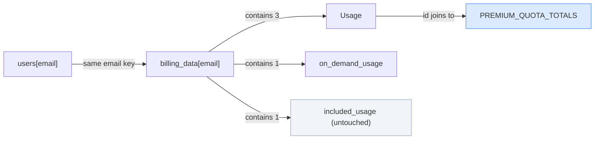

# Domain Entities — EPIC-1 Mid-Cycle Subscription Upgrade

**Depth**: Standard · **Scope**: system-level, scoped to `epic-brief.md`
**Existing state source**: `planning/reverse-engineering/knowledge-graph.md` (Atlas doc 3155)

> **Brownfield note**: the existing model is the **starting state**. This document records the
> **delta** only. No entity is invented; every existing field below was read from
> `src/backend/main.py`.

---

## 1. Existing entities (unchanged shape, newly mutable)

### `users[email]` — in-memory dict, keyed by email

| Field | Type | Existing value (Standard) | Delta |
|---|---|---|---|
| `id` | int | sequential | — |
| `name` | str | — | — |
| `email` | str | — | — |
| `password` | str | plain text | — *(pre-existing critical finding, out of scope)* |
| `plan` | str | `"Standard"` | **now mutable** → `"Premium"` |
| `price` | str | `"$20/month"` | **now mutable** → `"$40/month"` |
| `renew_at` | str `"%b %d, %Y"` | `today + 30 days` | **must remain unchanged** (AC-23) |

### `billing_data[email]` — in-memory dict, keyed by email

| Field | Type | Existing value (Standard) | Delta |
|---|---|---|---|
| `plan_name` | str | `"Standard"` | **now mutable** → `"Premium"` |
| `price` | str | `"$20/month"` | **now mutable** → `"$40/month"` |
| `renew_at` | str | `today + 30 days` | **must remain unchanged** (AC-23) |
| `usages` | list[Usage] | 3 entries at Standard totals | **totals raised**, `used` preserved (AC-21) |
| `included_usage` | dict | daily/weekly quota tiles | **unchanged** — the Epic does not touch it |
| `on_demand_usage.remaining_balance` | str | `"$18.00"` / `"$0.00"` | **unchanged** — the Epic does not touch it |
| `on_demand_usage.your_usage` | str | `"$0.00"` | **unchanged** |
| `on_demand_usage.notice` | str | Standard restriction text | **replaced** (AC-22) |

**⚠️ Two `renew_at` fields exist**, one in each dict, written independently at registration. AC-23
requires **both** to be untouched. A design that only preserves one would pass a naive test and still
be wrong.

### `Usage` (element of `billing_data[email]["usages"]`)

| Field | Type | Role in the upgrade |
|---|---|---|
| `id` | str | **Join key.** `"chat-credits"` \| `"chatbots"` \| `"documents-pages"`. Preserved. |
| `label` | str | Display name. **Preserved** (AC-21). |
| `used` | int | Consumption to date. **Preserved** (AC-21) — an upgrade raises the ceiling, it does not reset consumption. |
| `total` | int | The quota ceiling. **Raised** to the Premium value. |
| `help` | str | Tooltip. **Recomputed** for `documents-pages` — see decision D-3. |

---

## 2. New constants (no new entity types)

```python
PLANS = {
    "Standard": {"price": 20.0, "label": "$20/month"},
    "Premium":  {"price": 40.0, "label": "$40/month"},
}

PREMIUM_QUOTA_TOTALS = {
    "chat-credits":    10000,
    "chatbots":        10,
    "documents-pages": 5000,
}

DAYS_IN_CYCLE = 30

PREMIUM_ON_DEMAND_NOTICE = "On-demand credit is available on your Premium plan."
```

**Deviation from the Epic's literal `PREMIUM_QUOTAS`, with rationale (decision D-3)**: the Epic
declares `PREMIUM_QUOTAS` as a full list of three complete usage objects, each carrying
`used: 0`, a `label` and a `help` string. Assigning that list wholesale would **overwrite `used` with
0**, directly contradicting **AC-21**, and would set the `documents-pages` help text to
`"You can add 5000 more pages of your documents."` regardless of actual consumption. Reduced to an
`id → total` map so the merge can preserve `used` and `label` by construction rather than by care.

---

## 3. New request model

```python
class UpgradeRequest(BaseModel):
    email: str
```

**Exactly one field, deliberately.** No `amount`, no `plan`, no `card` — SEC-6 and AC-18 require the
charge to be server-computed, and a Pydantic model with no amount field makes a client-supplied price
structurally impossible rather than merely rejected.

---

## 4. New response shapes

### `GET /api/billing/upgrade-preview` — 200

```json
{
  "current_plan": "Standard",
  "new_plan": "Premium",
  "days_remaining": 29,
  "prorated_charge": 19.33,
  "next_renewal_price": 40.0,
  "renew_at": "Sep 30, 2026"
}
```

`days_remaining` and `prorated_charge` are computed; `renew_at` is echoed from storage unchanged.
The example values reflect finding **F-1** (`renew_at` is dynamic), not the Epic's stale fixture.

### `POST /api/billing/upgrade` — 200

```json
{ "status": "success", "plan": "Premium", "charge": 19.33 }
```

### Error shapes

| Status | Body | Trigger |
|---|---|---|
| 401 | `{"detail": "Not authenticated"}` | `email not in users` — matches the existing endpoints verbatim |
| 404 | `{"detail": "billing_record_not_found"}` | caller in `users` but absent from `billing_data` (F-3 / AC-9) |
| 409 | `{"detail": "already_premium"}` | `plan_name == "Premium"` |
| 402 | `{"detail": "card_declined", "message": "Your card was declined."}` | gateway declined |

---

## 5. Entity relationship



The two dicts are joined only by the email key, with **no referential integrity mechanism** — nothing
prevents them drifting apart. That is precisely why the upgrade must write both in one place, under
one guard (see `business-logic-model.md`, decision D-2).
