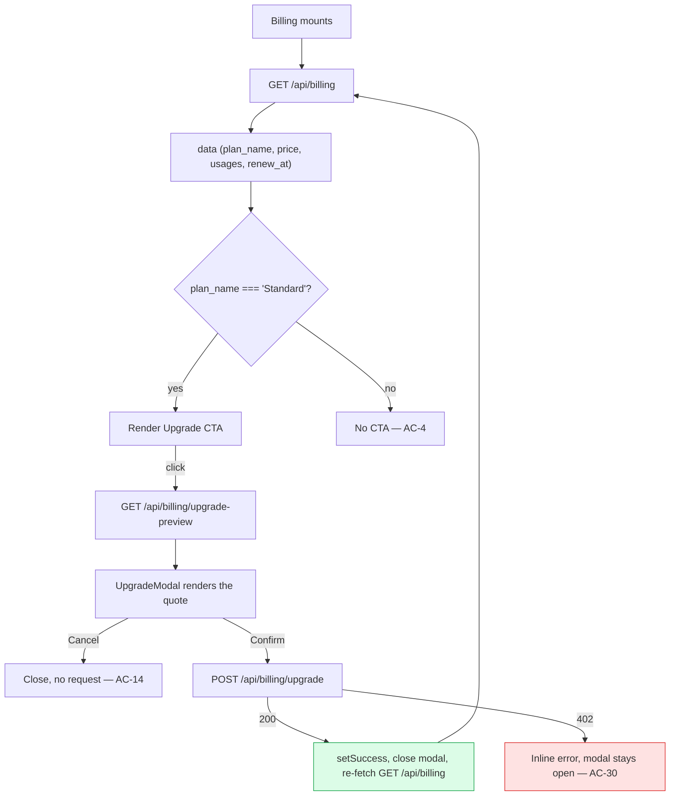

# Frontend Components — EPIC-1 Mid-Cycle Subscription Upgrade

**Depth**: Standard · **Layer**: `src/frontend/src/pages/Billing.jsx`
**Existing component**: 181 LOC, four local sub-components (`InfoIcon`, `UsageIcon`, `IncludedUsageCard`, `OnDemandUsageCard`) plus the default-exported `Billing`.
**No new dependency** (NFR-1) — React 19 hooks and plain CSS only, matching the existing file.

> **No design references were supplied** (`## Context Project` → New References: No), so there is no
> wireframe or mockup governing the visual treatment. The layout below follows the **existing page's
> own conventions** — the class names, card shapes and copy style already in `Billing.jsx` and
> `App.css`. Where the Epic specifies copy, it is used verbatim.

---

## 1. Component tree — delta only

```
Billing (existing, modified)
├── InfoIcon                    unchanged
├── UsageIcon                   unchanged
├── IncludedUsageCard           unchanged
├── OnDemandUsageCard           unchanged
├── UpgradeSuccessBanner        NEW   — AC-29
└── UpgradeModal                NEW   — AC-12..AC-15, AC-30, AC-31
```

Both new components are **local to `Billing.jsx`**, matching the file's existing convention of
declaring its sub-components inline. No new file, no new folder — consistent with the codebase and
with Application Design having been skipped (no new component boundary is introduced).

---

## 2. State shape

The Epic prescribes `useState` for `{ open, preview, loading, error, success }`. Split into two hooks
rather than one object, because `success` outlives the modal — it drives the banner after the modal
has closed, so bundling it into modal state would force the banner to render from a closed modal's
data.

```js
const [data, setData] = useState(null)          // existing — billing payload

const [upgrade, setUpgrade] = useState({        // NEW — modal lifecycle
  open: false,       // modal visible
  preview: null,     // upgrade-preview response, or null while loading
  loading: false,    // a request is in flight (preview OR confirm)
  error: null,       // inline error text shown inside the modal
})

const [success, setSuccess] = useState(null)    // NEW — { charge } once upgraded, else null
```

### State transitions

| Trigger | Transition |
|---|---|
| CTA clicked | `{open: true, preview: null, loading: true, error: null}` → fetch preview |
| Preview 200 | `{loading: false, preview: <body>}` |
| Preview non-200 | `{loading: false, error: "Could not load upgrade details. Please try again."}` |
| **Cancel** | `{open: false, preview: null, loading: false, error: null}` — **no request sent** (AC-14) |
| Confirm clicked | `{loading: true, error: null}` |
| Confirm 200 | `setSuccess({charge})`, then `{open: false, ...}`, then re-fetch `GET /api/billing` (AC-27) |
| Confirm 402 | `{loading: false, error: "Payment failed: Your card was declined. Your plan has not changed."}` — **modal stays open** (AC-30) |
| Confirm 409 | `{loading: false, error: "You are already on the Premium plan."}` then re-fetch billing so the page self-corrects |

---

## 3. Render changes

### 3.1 Dynamic plan label — replaces the hardcoded badge (AC-1)

`Billing.jsx:127-129` currently reads:

```jsx
<p className="current-label">
  Current plan: <span className="standard-badge">Standard</span>
</p>
```

Becomes:

```jsx
<p className="current-label">
  Current plan: <span className="standard-badge">{data.plan_name}</span>
</p>
```

**The `standard-badge` class name is kept as-is.** It is a styling hook, not a semantic claim, and it
is already defined in `App.css`. Renaming it would mean an unrelated CSS change for zero user-visible
benefit — out of scope. Noted so a reviewer does not read the retained name as a missed rename.

### 3.2 Plan card — real price and badge (AC-2)

The price already renders `{data.price}` (line 136), so it is correct once the backend updates
`billing_data`. The `"Active"` badge (line 139) is hardcoded; it stays literally `"Active"` because
that is a **subscription-status** label, not a plan name, and it is accurate on both plans. The plan
identity is carried by `data.plan_name` in 3.1 and by `{data.price}`. Recorded as a deliberate
reading of AC-2 rather than a gap.

### 3.3 Upgrade CTA (AC-3, AC-4)

Rendered inside the existing `plan-card`, below the price:

```jsx
{data.plan_name === 'Standard' && (
  <button className="upgrade-cta" onClick={openUpgrade}>
    Upgrade to Premium
  </button>
)}
```

Strict equality against `'Standard'` — not `!== 'Premium'` — so an unrecognised plan value shows no
CTA, mirroring BR-1's server-side posture.

### 3.4 `UpgradeModal` (AC-12, AC-13, AC-14, AC-30, AC-31)

Overlay + panel, no routing, no portal — rendered conditionally in the existing tree so the page
behind it stays mounted (AC-12: no navigation).

| Region | Content |
|---|---|
| Title | `Upgrade to Premium` |
| Row 1 | `Current plan` · `Standard ($20/mo)` |
| Row 2 | `New plan` · `Premium ($40/mo)` |
| Row 3 | `Days remaining in cycle` · `{preview.days_remaining}` |
| Highlight | `You will be charged $<preview.prorated_charge> today` |
| Footnote | `$40.00/month starting {preview.renew_at}` |
| Error slot | `{upgrade.error}` when set — modal stays open (AC-30) |
| Actions | **Confirm Upgrade** (primary, disabled while `loading` or `!preview`) · **Cancel** (secondary, always enabled — AC-31) |

**Amount formatting**: `preview.prorated_charge.toFixed(2)` — display formatting only. This is **not**
a violation of AC-15/FR-6: the value is not computed, derived or adjusted, only padded to two decimal
places so `19.3` renders as `19.30`. No pricing arithmetic appears anywhere in `Billing.jsx`.

**Cancel remains enabled during a request** so a user is never trapped in a modal by a slow or hung
call — AC-31 requires cancel to work after a failure, and a disabled-while-loading Cancel would fail
that if a request never settles.

### 3.5 `UpgradeSuccessBanner` (AC-29)

```jsx
{success && (
  <div className="upgrade-banner">
    You are now on Premium! ${success.charge.toFixed(2)} was charged.
  </div>
)}
```

Rendered at the top of `page-card`, above `billing-header`, so it is visible without scrolling. Copy
is the Epic's, with the apostrophe-free phrasing used throughout this cycle's artifacts.

---

## 4. Data flow



The success path deliberately **re-fetches** rather than patching local state from the POST response.
The server is the source of truth for quotas and the notice, and a re-fetch proves end to end that the
mutation actually landed — which is what AC-27 asks for.

---

## 5. Error handling on the new calls (FR-10)

Every new `fetch` uses `async/await` inside `try/catch/finally`, unlike the existing
`.then().then()` chains:

- **`catch`** sets `upgrade.error` to a human-readable message. A network failure, a non-JSON body and an unexpected status all land somewhere visible — never a silent swallow.
- **`finally`** always clears `loading`, so no path can leave a spinner stuck or Confirm permanently disabled.
- Non-200 responses are checked explicitly via `res.ok` before parsing, and the 402 body's `message` is preferred when present so the gateway's own wording reaches the user.

**Finding F-5 note**: the *existing* billing fetch at lines 105-107 still has no `.catch()`. It is
out of scope and deliberately untouched, so the file will temporarily hold both patterns. Flagged here
so a reviewer reads that as a scope boundary rather than an oversight.

---

## 6. New CSS classes

Added to `src/frontend/src/App.css`, following its existing flat-class, no-preprocessor convention:

| Class | Purpose |
|---|---|
| `.upgrade-cta` | Primary button in the plan card |
| `.upgrade-modal-overlay` | Fixed, dimmed backdrop |
| `.upgrade-modal` | Centred panel |
| `.upgrade-modal-row` | Label/value row |
| `.upgrade-modal-charge` | Emphasised prorated amount |
| `.upgrade-modal-actions` | Button row |
| `.upgrade-modal-error` | Inline error text |
| `.upgrade-banner` | Success banner |

No existing class is redefined, so no existing page can regress visually.

---

## 7. Accessibility

Not an explicit acceptance criterion, but the modal is a new interactive surface and these cost
nothing to get right at build time:

- `role="dialog"` and `aria-modal="true"` on `.upgrade-modal`, labelled by its title via `aria-labelledby`
- `Escape` closes the modal on the same path as Cancel
- Focus moves to the modal on open and returns to the CTA on close
- The error slot is `role="alert"` so a declined payment is announced, not just displayed
- The banner is `role="status"` — informative, not interrupting
