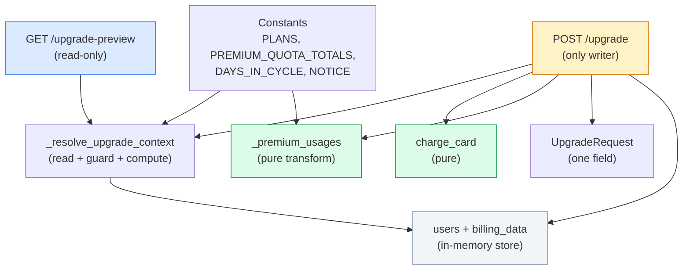
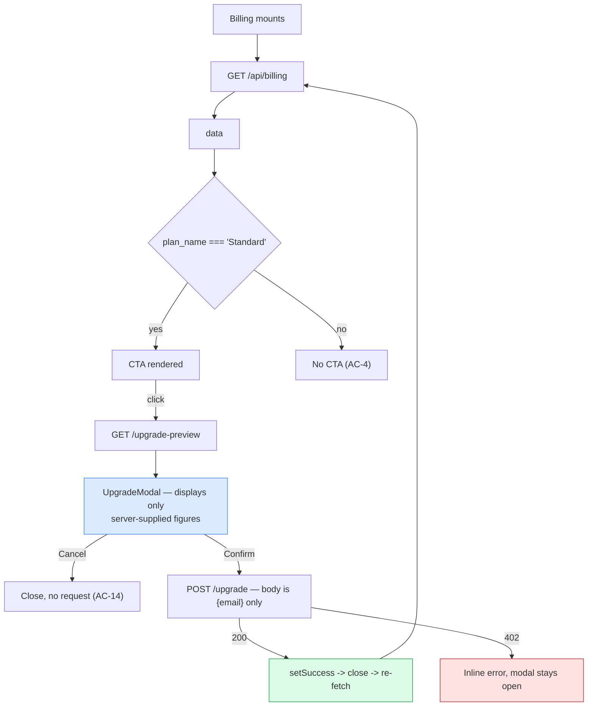

# Logical Components — EPIC-1 Mid-Cycle Subscription Upgrade

**Depth**: Minimal · **Companion**: `nfr-design-patterns.md` (P-1..P-7)

> **No new deployable component, module, package or service is introduced.** Everything below is a
> logical unit *inside* two existing files. This document exists to make the internal boundaries and
> the NFR ownership explicit, so a reviewer can see which unit is responsible for which guarantee.

---

## 1. Backend logical units — inside `src/backend/main.py`

| Unit | Kind | Purity | Owns which NFRs | Pattern |
|---|---|---|---|---|
| `PLANS`, `PREMIUM_QUOTA_TOTALS`, `DAYS_IN_CYCLE`, `PREMIUM_ON_DEMAND_NOTICE` | module constants | — | Single source of pricing and quota truth; no magic number appears in a handler | — |
| `UpgradeRequest` | Pydantic model | — | NFR-S3, NFR-S6 — one field, so a client price is impossible | P-4 |
| `charge_card(email, amount)` | pure function | **pure** | NFR-S4 (no I/O, no logging), NFR-P2 (no network) | P-4 |
| `_resolve_upgrade_context(email)` | guard + compute | reads store, writes nothing | NFR-C1, NFR-M3, NFR-S1, NFR-S2, NFR-S5, NFR-P1 | P-1 |
| `_premium_usages(existing)` | pure transform | **pure** | NFR-C7, NFR-M4 | P-3 |
| `GET /api/billing/upgrade-preview` | route handler | **read-only** | Composes P-1; writes nothing, charges nothing | P-1 |
| `POST /api/billing/upgrade` | route handler | the only writer | NFR-C5, NFR-C6 via zoning | P-1, P-2, P-3, P-5, P-6 |

### Internal dependency direction

Green = pure · Blue = read-only · Amber = the single write site · Grey = the store.

**Acyclic, one direction, one writer.** The two pure units depend on constants only, so they are
testable with no fixture and no app instance. `_resolve_upgrade_context` reads the store but never
writes it. Exactly one node touches the store for writing, which is what makes P-2's zoning
auditable at a glance.

### Where the God module stands

Adding 4 units and 2 handlers takes `main.py` from 212 to roughly 300 lines. Atlas already flags it as
a God module (🟡 Medium). **Deliberately not split** — `tech-stack-decisions.md` Section 4 records
why: a restructure would blow the regression baseline for a change with no user-visible benefit, and
the Epic scopes out unrelated changes. The `_`-prefixed helpers keep the new surface visibly internal,
so a later split into `routers/billing.py` + `services/upgrade.py` has clean seams. Recorded as debt,
not silently accepted.

---

## 2. Frontend logical units — inside `src/frontend/src/pages/Billing.jsx`

| Unit | Kind | Owns | Pattern |
|---|---|---|---|
| `upgrade` state `{open, preview, loading, error}` | `useState` | Modal lifecycle; `loading` always cleared in `finally` | P-7 |
| `success` state `{charge}` \| `null` | `useState` | Banner visibility — kept **separate** because the banner outlives the modal | P-7 |
| `openUpgrade()` | async handler | Fetches the preview; sets `error` on any failure | P-7 |
| `confirmUpgrade()` | async handler | POSTs; on 200 re-fetches billing; on 402 keeps the modal open | P-7 |
| `UpgradeModal` | local component | AC-12..AC-15, AC-30, AC-31; accessibility (`role="dialog"`, Escape, focus, `role="alert"`) | P-7 |
| `UpgradeSuccessBanner` | local component | AC-29; `role="status"` | — |
| CTA conditional | inline JSX | AC-3, AC-4 — strict `=== 'Standard'` | — |

Both new components are **local to the file**, matching its existing convention of inline
sub-components (`InfoIcon`, `UsageIcon`, `IncludedUsageCard`, `OnDemandUsageCard`). No new file, no new
folder, no new component boundary — consistent with Application Design having been skipped.

### Frontend data flow and trust boundary

**Trust boundary**: the frontend is a **pure display surface** for every monetary value. It formats
with `.toFixed(2)` and does no arithmetic — no multiplication, no division, no subtraction on any
price or quota figure. That is the mechanically checkable form of AC-15 / FR-6 / NFR-S6: a static scan
of `Billing.jsx` for pricing arithmetic should find none.

---

## 3. Unchanged components — the negative boundary

| Component | Status | Why it matters |
|---|---|---|
| `src/frontend/src/context/AuthContext.jsx` | **read, not modified** | Supplies `token`. Modifying it would touch the auth flow, which the epic-level AC forbids. |
| `src/frontend/src/App.jsx` | untouched | Routing unchanged — the modal deliberately does not navigate (AC-12). |
| `src/frontend/vite.config.js` | untouched | Its existing `/api` proxy already covers both new routes. |
| `src/frontend/src/pages/Login.jsx`, `Tasks.jsx` | untouched | Out of scope. |
| Existing endpoints (6) | untouched | Including `GET /api/billing`'s seed-user fallback (F-3) — its output shape is unchanged, which is what keeps the regression baseline valid. |
| `src/backend/requirements.txt`, `src/frontend/package.json` | **byte-identical** | NFR-M1. A zero-line diff here is a Section 10 constraint candidate. |
| `included_usage`, `on_demand_usage.remaining_balance` / `.your_usage` | untouched | The Epic changes only `notice`. Touching the balance would invent a pricing decision nobody made. |

---

## 4. Test-side logical components

New, since the repo has zero tests.

| Unit | Location | Covers |
|---|---|---|
| Proration unit tests | `tests/unit/` | NFR-C1 exhaustively over `days_remaining` 1..30; NFR-C2, C3 |
| Guard-chain tests | `tests/unit/` | NFR-S1 (401), AC-9 (404), NFR-C-guards (409), and the **ordering** between them |
| Gateway tests | `tests/unit/` | NFR-M4 purity; `fail` prefix determinism and case sensitivity (BR-9) |
| Quota-merge tests | `tests/unit/` | NFR-C7; input list not mutated; unknown `id` passed through |
| Upgrade happy-path tests | `tests/unit/` | AC-19..AC-23, including **both** `renew_at` copies |
| Declined-path tests | `tests/unit/` | NFR-C5 via deep snapshot compare; exact 402 body |
| Price-injection test | `tests/unit/` | NFR-S6 — an `amount` in the body is ignored |
| Gherkin step definitions | `tests/behavior/` | The B1/B2/B3 tiers against `story-1.1.feature` |
| Playwright specs | `tests/e2e/` | NFR-M6, post-merge via `/playwright-implement` |

**Coverage note carried forward**: the repo starts at 0%, so `unitTestCoverageMin` must be applied to
the **changed surface**, not the whole repo. Flagged for the STOP CHECKPOINT.
