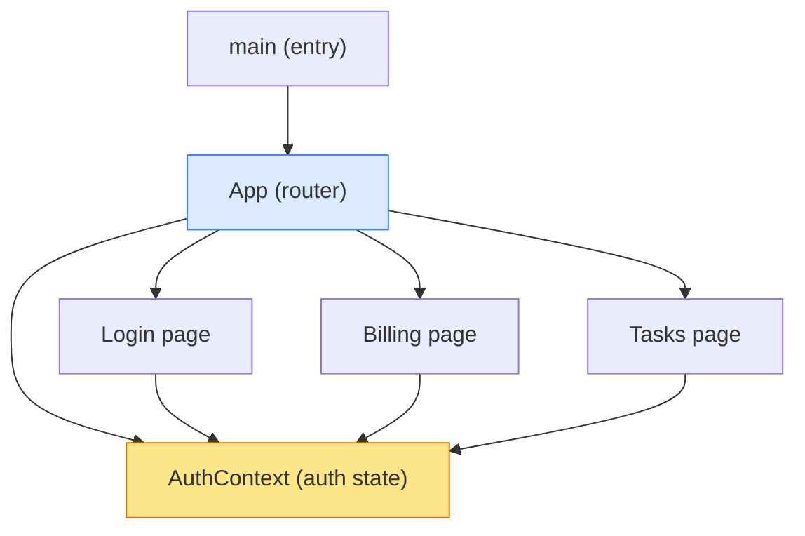
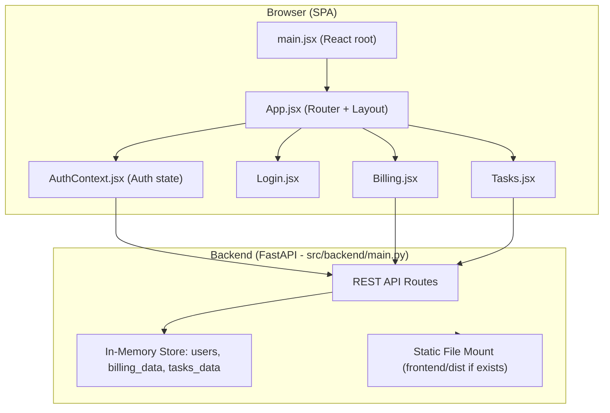

> **Source**: Atlas via Helix MCP
> **Server / tool**: helix · get_solution_document_tool (document_id 3155, v28, CURRENT) · get_session_context_tool
> **Estate**: solution_id 874 — "Billing-Cycle-AIRE-V1-Demo" · repo Billing-Cycle @ main · last ingested commit bcec649e08f2dbec435c24066deae6a1d6d71192
> **Scope pulled**: All 8 components of the estate. The estate is a single repo of ~808 LOC across 11 code files, so the "components the work touches plus one hop" rule (Section 4.1) resolves to the whole system.
> **Fetched**: 2026-08-31T11:05Z
> **Freshness**: Atlas reports document updated_at 2026-08-25T11:22:52Z; repo ingested at commit bcec649
>
> **PATH MAPPING**: Atlas documents the upstream layout (`backend/`, `frontend/`). This workspace has
> the backend at `src/backend/` and the frontend at `frontend/`. Paths below are given in **this
> workspace's** real form; Atlas content is otherwise unaltered.

# Knowledge Graph — Billing-Cycle

**Written once per cycle.** Not regenerated per work unit.

---

## 1. Component Inventory

| Component | Path (this workspace) | Responsibility | Complexity | Key Dependencies | Known Issues |
|---|---|---|---|---|---|
| **FastAPI App** | `src/backend/main.py` | All backend: routes, data, models, static serving | Medium (God module) | FastAPI, Pydantic, uvicorn | God module, no tests, plain-text passwords, email-as-token |
| **App** | `frontend/src/App.jsx` | Router setup, Layout shell, ProtectedRoute guard | Simple | react-router-dom, AuthContext | Route `/` goes to Login (no redirect for logged-in users) |
| **AuthContext** | `frontend/src/context/AuthContext.jsx` | Auth state, login/register/logout API calls, session persistence | Medium | React Context, fetch, localStorage | Token = email, no refresh, logout on any fetch error |
| **Login** | `frontend/src/pages/Login.jsx` | Login + Sign-up forms, split-screen marketing panel | Medium | AuthContext | Hard-coded demo credentials in state defaults |
| **Billing** | `frontend/src/pages/Billing.jsx` | Billing dashboard: plan card, usage bars, included/on-demand tiles | Medium | AuthContext, fetch | No error handling on fetch, no loading skeleton |
| **Tasks** | `frontend/src/pages/Tasks.jsx` | Task list display + add-task form | Simple | AuthContext, fetch | No error handling, no delete/toggle, no optimistic updates |
| **Vite Config** | `frontend/vite.config.js` | Build config + `/api` dev proxy to `:8000` | Trivial | Vite, @vitejs/plugin-react | None |
| **main (entry)** | `frontend/src/main.jsx` | React DOM mount, bootstraps `<App>` in StrictMode | Trivial | App.jsx | None |

---

## 2. Internal Dependency Graph

**Circular dependencies: none.** The graph is a clean tree.

### Coupling Metrics

| Module | Afferent (Ca) | Efferent (Ce) | Instability | Assessment |
|---|---|---|---|---|
| `AuthContext.jsx` | 4 (App, Login, Billing, Tasks) | 1 | 0.2 | Stable — core hub |
| `App.jsx` | 1 (main.jsx) | 4 | 0.8 | Unstable — orchestrator |
| `Login.jsx` | 1 (App) | 1 | 0.5 | Balanced |
| `Billing.jsx` | 1 (App) | 1 | 0.5 | Balanced |
| `Tasks.jsx` | 1 (App) | 1 | 0.5 | Balanced |
| `main.jsx` | 0 | 1 | 1.0 | Entry point — expected |
| `src/backend/main.py` | 0 | 4 (fastapi, pydantic, pathlib, datetime) | 1.0 | God module — all deps concentrated |

---

## 3. System Architecture

### Architectural Style

**Full-Stack Monolith (POC/Demo tier)** — single Python module backend + single-page React frontend.

**Patterns present**: Context Provider (React) · Protected Route · Vite dev proxy for `/api/*` · conditional static-file serving of `frontend/dist` · Pydantic request validation at the API boundary · in-memory mock store (3 dicts).

**Anti-patterns present**: God module (`src/backend/main.py`) · email-as-token · wildcard CORS with `allow_credentials=True` · plain-text passwords · no `.catch()` on frontend fetches · hard-coded demo credentials in the Login form.

---

## 4. Data Stores (integration points the work will read/write)

**No database.** Python dicts are the data layer, keyed by email.

| Store | Key | Contents | Persistence |
|---|---|---|---|
| `users` | email | id, name, email, password (plain), plan, price, renew_at | In-memory only |
| `billing_data` | email | plan_name, price, renew_at, usages[], included_usage, on_demand_usage | In-memory only |
| `tasks_data` | email | list of {id, title, status, due} | In-memory only |

Query pattern: direct `dict.get(email)` — O(1), reset on every process restart.

**⚠️ In scope for this cycle**: `billing_data` and `users` are exactly the two stores the Mid-Cycle Upgrade Epic mutates.

---

## 5. API Surface (existing — 6 endpoints)

| Method | Route | Description |
|---|---|---|
| POST | `/api/auth/login` | Authenticate with email/password, returns mock token (= email) |
| POST | `/api/auth/register` | Create new in-memory user, seed billing_data + one task |
| GET | `/api/users/me?email=` | Fetch current user profile |
| GET | `/api/billing?email=` | Fetch billing plan + usage data |
| GET | `/api/tasks?email=` | Fetch task list |
| POST | `/api/tasks` | Add new task |

**Entry points**: `frontend/src/main.jsx` (React mount) · `src/backend/main.py` (`uvicorn main:app --port 8000`).
**No CLI, no background jobs, no scheduled tasks, no external service integrations.**

---

## 6. Existing Flows (6 total)

| # | Flow | Category | Notes relevant to this cycle |
|---|---|---|---|
| 1 | Login | Auth | Backend 401 → frontend catches, shows inline error. No rate limiting or lockout. |
| 2 | Registration | Auth | Seeds zeroed `billing_data` at **Standard** quotas + one starter task. |
| 3 | Session Restore | Auth | `GET /api/users/me` on mount; 401 → `logout()`. Server restart wipes all users. |
| 4 | **Billing Dashboard Load** | Data | **The flow this Epic extends.** `GET /api/billing?email=<token>` → `setData()`. ⚠️ No `.catch()` — a 401 or network error leaves the page on "Loading billing..." forever. |
| 5 | Task List Load | Data | No error handling, no empty state. |
| 6 | Add Task | Mutation | Full re-fetch after mutation (no optimistic update). |

**Cross-cutting concern**: `AuthContext` is the hub of every data flow — `token` (the raw email) is simultaneously session id, auth credential, and API query parameter.

---

## 7. Technology Stack

| Layer | Technology | Version |
|---|---|---|
| UI framework | React / React DOM | ^19.2.8 |
| Routing | react-router-dom | ^7.18.2 |
| Build | Vite | ^8.2.2 |
| React plugin | @vitejs/plugin-react | ^6.1.0 |
| Linter | Oxlint | ^1.79.0 |
| API framework | FastAPI | **unpinned** |
| ASGI server | uvicorn[standard] | **unpinned** |
| Form parsing | python-multipart | **unpinned** |
| Validation | Pydantic | via FastAPI |

**Testing framework: none — zero test files exist.** **CI/CD: none detected by Atlas.**

*Note: this workspace does have `.github/workflows/distribute-framework.yml`, which post-dates Atlas's ingest and is unrelated to the application.*

**Frontend dependency health: excellent** (all at current majors).
**Backend dependency health: concerning** — zero version pinning on all three packages.

---

## 8. Scope resolution for this cycle

Per Section 4.1, the components the Mid-Cycle Subscription Upgrade Epic touches:

1. **Named in the Epic**: `src/backend/main.py`, `frontend/src/pages/Billing.jsx`
2. **Direct dependencies / dependents (one hop)**: `frontend/src/context/AuthContext.jsx` (supplies `token`), `frontend/src/App.jsx` (routes to Billing)
3. **Owns a data store the work writes**: `src/backend/main.py` — owns `users` and `billing_data`

**Incremental extension note**: Atlas document 3155 has 1179 lines. Lines 1–600 (executive summary, reconnaissance, architecture, flows, dependencies) were pulled and are transcribed above. Lines 601–1179 (code quality & technical debt, test coverage, security considerations, performance, documentation audit, recommendations, appendices) remain in Atlas and are pulled **incrementally** when a stage needs them — the Security Baseline review and the design stages will pull the security and quality sections. Each extension is noted here when it happens.
