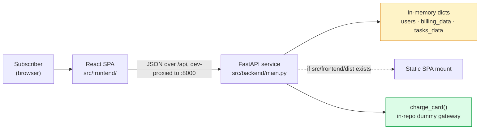

# Architecture — Billing-Cycle

> **Version**: 1.0.0 · **Generated**: 2026-08-31T12:20:00Z · **AIRE**: v1.0
> **Derived from**:
> - `.spec/aire-docs/planning/reverse-engineering/knowledge-graph.md` (Atlas doc 3155)
> - `.spec/aire-docs/planning/requirements/epic-brief.md` (Atlas doc 3157)
> - `.spec/aire-docs/planning/requirements/requirements.md`
> - `.spec/aire-docs/planning/user-stories/stories.md`
> - `.spec/aire-docs/planning/dependency-graph.yml`
> - `.spec/aire-docs/planning/plans/execution-plan.md`
> - `.spec/aire-docs/implementation/design/functional-design/` (4 artifacts)
> - `.spec/aire-docs/implementation/design/nfr-requirements/` (2 artifacts)
> - `.spec/aire-docs/implementation/design/nfr-design/` (2 artifacts)
> - `aire-state.md` → `## Design References` + `### Reconciliations`
>
> **Existing-system baseline**: Atlas via Helix MCP, estate `solution_id 874` —
> "Billing-Cycle-AIRE-V1-Demo", repo `Billing-Cycle` @ `main`, ingested at commit `bcec649`.
>
> 🔴 **Assembled, not authored.** Every decision below was already made and approved in a design
> stage. This document introduces no new architecture. Sections whose design stage was skipped say so
> explicitly and state the default instead.

---

## 1. System Context

Billing-Cycle is a full-stack proof-of-concept billing and task portal. A React 19 single-page
application talks to a FastAPI service over 6 (soon 8) JSON endpoints. There is **no database**: three
Python dictionaries in the service process are the data layer, and all data is lost on restart. There
are **no external service integrations** — including, deliberately, no payment provider.

This cycle adds a **self-serve mid-cycle plan upgrade** (Standard $20/mo → Premium $40/mo) with
server-computed proration and an in-repo deterministic dummy payment gateway.



**Callers**: the browser only. **Called systems**: none — `charge_card()` is in-process, which is why
the box is green rather than an external boundary.

---

## 2. Component Inventory

| Component | Responsibility | Status | Source |
|---|---|---|---|
| FastAPI service | All routes, models, data store, static serving | existing (modified) | Atlas doc 3155 |
| `UpgradeRequest` | Upgrade request body — one field, `email` | **new** | functional-design/domain-entities.md Section 3 |
| `charge_card` | Deterministic dummy payment gateway | **new** | functional-design/business-logic-model.md Section 2 |
| `_resolve_upgrade_context` | Shared guard chain (401/404/409) + proration | **new** | nfr-design/nfr-design-patterns.md P-1 |
| `_premium_usages` | Pure quota-ceiling transform | **new** | nfr-design/nfr-design-patterns.md P-3 |
| `GET /api/billing/upgrade-preview` | Prorated quote — read-only | **new** | functional-design/business-logic-model.md Section 3 |
| `POST /api/billing/upgrade` | Charge, then flip plan and quotas | **new** | functional-design/business-logic-model.md Section 3 |
| `Billing` page | Billing dashboard | existing (modified) | Atlas doc 3155 |
| `UpgradeModal` | Confirmation panel showing the quote | **new** | functional-design/frontend-components.md Section 3.4 |
| `UpgradeSuccessBanner` | Post-upgrade confirmation banner | **new** | functional-design/frontend-components.md Section 3.5 |
| `AuthContext` | Auth state, supplies `token` (= email) | existing (**read only**) | Atlas doc 3155 |
| `App`, `Login`, `Tasks`, Vite config | Routing, auth UI, tasks, build | existing (untouched) | Atlas doc 3155 |

---

## 3. Layering and Boundaries

Rules, stated as rules — not aspirations:

1. **The frontend never computes money.** No changed frontend file performs arithmetic on a price or
   quota value. `.toFixed(2)` display formatting is permitted; `* / + -` on a monetary or quota figure
   is not. The frontend is a display surface for values the API returns.
2. **Exactly one component writes plan state.** `POST /api/billing/upgrade` is the only writer of
   `users[email]["plan"|"price"]` and `billing_data[email]`. No other handler, helper or module writes
   them.
3. **Guards live in one function.** The 401 → 404 → 409 chain and the proration formula exist only in
   `_resolve_upgrade_context`. Handlers compose it; they never re-implement it.
4. **Pure units stay pure.** `charge_card` and `_premium_usages` perform no I/O, read no clock, use no
   randomness, and do not mutate their arguments.
5. **The store is reached only by the caller's own key.** Every lookup is `users[email]` or
   `billing_data[email]` for the authenticated caller. No fallback record, no cross-email read.

**Layering is enforced by convention and review, not by a module boundary** — the backend is a single
module (see Section 11). The `_` prefix marks internal units.

---

## 4. Data Architecture

**No database. No migrations. No transactions.** Three module-level dicts keyed by email:

| Store | Owner | Written by this cycle |
|---|---|---|
| `users` | FastAPI service | `plan`, `price` only |
| `billing_data` | FastAPI service | `plan_name`, `price`, `usages`, `on_demand_usage.notice` only |
| `tasks_data` | FastAPI service | never |

**Never written**: `renew_at` in **either** dict · `included_usage` · `on_demand_usage.remaining_balance`
and `.your_usage` · `id`, `name`, `email`, `password` · every field of `tasks_data`.

### Transaction boundary — the substitute for a transaction

There is no transaction mechanism, so atomicity is achieved **structurally** (nfr-design P-2). The
upgrade handler is divided into three zones with a rule about what each may contain:

| Zone | Contents | May raise |
|---|---|---|
| A — read, validate, compute | guards, proration, the gateway call, **the 402 raise** | yes |
| B — build | `_premium_usages`, label lookup — pure, returns new values | yes |
| C — assign | the only 6 dict writes, on already-resolved values | **no** |

The declined branch returns from Zone A, so no assignment is reachable from it. Zone C contains only
`dict[key] = value` — no call, arithmetic, parse or `await` — so a partial write is impossible rather
than merely unlikely. The handler is `def`, not `async def`, so no request observes Zone C mid-flight.

`renew_at` is preserved **by omission**: no line assigns it.

### Data model delta

New constants: `PLANS` · `PREMIUM_QUOTA_TOTALS` (an `id → total` map) · `DAYS_IN_CYCLE = 30` ·
`PREMIUM_ON_DEMAND_NOTICE`.

> ⚠️ **Deviation from the Epic's stated design, recorded.** The Epic declares `PREMIUM_QUOTAS` as
> three complete usage objects carrying `used: 0`. Assigning that list wholesale would reset
> consumption to zero, contradicting AC-21. Reduced to an `id → total` map so `id`, `label` and `used`
> are preserved by construction. Source: functional-design/business-logic-model.md decision D-3.

---

## 5. API and Integration Contracts

**Protocol**: JSON over HTTP. **Auth model**: the caller's email, passed as a query parameter (GET) or
a body field (POST), checked against the `users` dict. This is the system's **pre-existing** auth
mechanism, retained unchanged — see Section 11.

### New contracts

**`GET /api/billing/upgrade-preview?email=<str>`** — read-only, idempotent, charges nothing.

```json
{ "current_plan": "Standard", "new_plan": "Premium", "days_remaining": 29,
  "prorated_charge": 19.33, "next_renewal_price": 40.0, "renew_at": "Sep 30, 2026" }
```

**`POST /api/billing/upgrade`** — body `{"email": str}` and nothing else.

```json
{ "status": "success", "plan": "Premium", "charge": 19.33 }
```

### Error taxonomy — fixed literals, zero interpolation

| Status | Body | Condition |
|---|---|---|
| 401 | `{"detail": "Not authenticated"}` | `email not in users` — checked first |
| 404 | `{"detail": "billing_record_not_found"}` | no `billing_data` entry for the caller |
| 409 | `{"detail": "already_premium"}` | `plan_name != "Standard"` |
| 402 | `{"detail": "card_declined", "message": "Your card was declined."}` | gateway declined |

The order is load-bearing: any other order tells an unauthenticated caller whether an email exists,
has a billing record, or is Premium.

**Implementation note carried from design**: `HTTPException(detail=...)` serialises to a single
`detail` key and cannot produce the 402's two-key body without nesting. The 402 is returned as an
explicit `JSONResponse`.

**Versioning**: none. The two new routes are additive; no existing response shape changes, which is
what keeps the regression baseline valid.

**Consumed contracts**: none. `charge_card` is in-process.

---

## 6. Cross-Cutting Decisions

| Concern | Decision |
|---|---|
| **AuthN** | Unchanged — email-as-token, pre-existing. Both new endpoints reuse the existing `email not in users` → 401 check verbatim. |
| **AuthZ** | Every operation is on the caller's own record. There are no roles, no admin path, and no endpoint that accepts a target email other than the caller's. |
| **Error handling** | Fixed-literal bodies (Section 5). No f-string, exception text, or dict content in any error response. |
| **Logging and redaction** | **No logging exists in the new code** — no logging call, no `print`. `charge_card` performs no I/O. Redaction is unnecessary because nothing is emitted. |
| **Configuration and secrets** | None introduced. No env var, no config file, no key. The gateway is a pure function with no credential. |
| **Observability** | None. Consistent with the existing system, which has none. Not invented here. |
| **Resilience** | The Resiliency Baseline extension was **declined** by the user, so no retry, timeout or circuit-breaker pattern is introduced. Defensible because the only "remote" call is an in-process pure function with no failure mode to retry. |
| **Concurrency** | Handlers are synchronous `def`. FastAPI runs them on a worker thread and each runs to completion, so the Zone C write block has no interleaving point. No lock is used, and none is needed at POC scale. |
| **Idempotency** | The upgrade is **idempotent by guard**, not by nature: a second call is refused with 409, so a double charge is impossible. There is no idempotency key. |
| **Money arithmetic** | Python `float` with `round(x, 2)`, per the Epic's explicit formula. Justified in decision D-1 by exhaustive verification over the full 30-value `days_remaining` domain, no accumulation, and no persistence. **Reversal condition**: adopt `Decimal` the moment charges are persisted, summed, or reconciled against a real provider. |

---

## 7. Non-Functional Targets

| Concern | Target | Source | How it is verified |
|---|---|---|---|
| Proration correctness | Exact for every integer `days_remaining` in 1..30 | nfr-requirements NFR-C1 | Unit test over the **whole** 30-value domain — exhaustive, not sampled |
| Charge bounds | `0.67 <= charge <= 20.00` | NFR-C3 | Invariant assertion, never a literal amount |
| Atomicity on decline | Zero fields differ after a 402 | NFR-C5 | Deep-compare a pre-request snapshot |
| `renew_at` immutability | Identical in **both** dicts after upgrade | NFR-C6 | Assert both copies separately |
| Consumption preservation | `used` unchanged for every usage entry | NFR-C7 | Compare entry-by-entry on `id` |
| Endpoint complexity | O(1) plus O(3) over the caller's usage list | NFR-P1 | Code review — no scan over any store |
| External latency | None — no network call in the request path | NFR-P2 | `charge_card` performs no I/O |
| Changed-surface coverage | `unitTestCoverageMin` from `.evals/config.json` | NFR-M2 | Coverage gate |
| No new dependency | Zero added lines in either manifest | NFR-M1 | Manifest diff |
| No new security violation | None added, none widened | NFR-S7 | Diff-scoped Security Baseline review |

**Deliberately unset**: throughput, latency percentiles, availability, error budgets. A single uvicorn
process with an in-memory store that loses all data on restart, and no load harness, makes any such
figure unverifiable. Stating one would be fiction. Source: nfr-requirements Section 5.

---

## 8. Infrastructure and Deployment

> ⏭️ **Infrastructure Design was SKIPPED** — execution-plan.md Section 4, zero infrastructure delta.
> This section records what the system does **by default**; no decision was invented for it.

**Unchanged from the existing system:**

| Aspect | Value |
|---|---|
| Runtime topology | One `uvicorn main:app --port 8000` process; Vite dev server on `:5173` proxying `/api` |
| Deployment unit | The repo. Production mode mounts `src/frontend/dist` at `/` from the FastAPI process if it exists |
| Environments | Local only |
| Scaling model | **None possible.** The in-memory store makes horizontal scaling impossible and the single process is a SPOF — an Atlas critical finding, pre-existing, out of scope |
| External dependencies | None |
| New infrastructure | **None.** No container, cloud resource, queue, scheduled job, env var, or config change. The existing `/api` Vite proxy already routes both new endpoints with no edit |

> ✅ **Finding F-4 is RESOLVED — by a repository relocation, not by this Epic.** The static mount
> computes `Path(__file__).resolve().parent.parent / "frontend" / "dist"`, which from
> `src/backend/main.py` resolves to `src/frontend/dist`. When F-4 was raised during Requirements
> Analysis the frontend still sat at repo-root `frontend/`, so that path was wrong and production
> static serving was broken. The frontend tree has since been moved to `src/frontend/`, which makes the
> existing expression correct with **no code change**.
>
> `src/frontend/dist` does not exist yet because no production build has been run; the mount is
> conditional (`if dist_dir.is_dir()`), so this is expected and harmless. Local dev via the Vite proxy
> was never affected. **No action for this cycle** — the defect went away on its own, and this Epic
> still changes nothing about static serving.

---

## 9. Delta from the Existing System

| Area | Before (Atlas doc 3155) | After | Reason |
|---|---|---|---|
| Endpoints | 6 | **8** — two additive routes | FR-4, FR-7 |
| Plan mutability | `plan`/`plan_name` written only at registration, then immutable | Mutable via one guarded endpoint | FR-7 |
| Billing page plan label | Hardcoded `"Standard"` at `Billing.jsx:128` | Renders `data.plan_name` | FR-1 |
| Upgrade path | **None in the product** | Self-serve CTA → quote → confirm | Epic goal |
| Payment | No payment code of any kind | In-repo deterministic `charge_card` | FR-12 |
| Frontend error handling | `.then().then()`, no `.catch()` | New calls use `try/catch/finally`; **existing fetch untouched** (F-5) | FR-10; scope boundary |
| Request models | 4 (one unused) | **5** — `UpgradeRequest` added; unused `TokenRequest` left in place (F-6) | FR-7; scope boundary |
| Tests | **Zero, repo-wide** | First tests in the repo, on the changed surface | NFR-M2 |
| Auth, tasks, login, registration | — | **Unchanged** | Epic-level AC |
| Data layer | 3 in-memory dicts | **Unchanged** — still 3 dicts, no persistence | Out of scope |

---

## 10. ✅ Verifiable Constraints

Six constraints. Every one is violable by ordinary code, decidable from a diff, and traceable to an
approved design decision. **Weights sum to 1.00.**

### ARCH-01 — Charge before write, single write site
- **Constraint**: In any code path that both invokes the payment gateway and writes subscription state, every state write occurs after a successful gateway result, in one contiguous block.
- **Verifiable as**: In the changed diff, no assignment to `users[...]` or `billing_data[...]` appears before the `charge_card(...)` call, and the declined branch returns or raises before reaching any assignment. Score 0 if any state write precedes the gateway call, is reachable from the declined branch, or is separated from the other writes by a call that can raise.
- **Weight**: 0.28
- **Source**: `implementation/design/nfr-design/nfr-design-patterns.md` P-2; `functional-design/business-logic-model.md` D-2

### ARCH-02 — Monetary values are computed server-side only
- **Constraint**: The charged amount is computed in the backend from stored state; no request model accepts it and no frontend file derives it.
- **Verifiable as**: No request model in the diff declares an `amount`, `price`, `charge`, or `total` field. No changed frontend file applies `*`, `/`, `+` or `-` to a price or quota value — `.toFixed()` formatting is permitted. Score 0 for any such request field or any pricing arithmetic in a changed frontend file.
- **Weight**: 0.22
- **Source**: `nfr-design/nfr-design-patterns.md` P-4, P-6; `nfr-requirements.md` NFR-S3, NFR-S6

### ARCH-03 — Data access is scoped to the calling identity
- **Constraint**: Every store lookup uses the authenticated caller's own email as its key, and a missing record is an error rather than a substitution.
- **Verifiable as**: No changed code path passes a fallback value to a `users` or `billing_data` lookup (the `.get(email, <default>)` shape), and no lookup is keyed by an email other than the caller's. A missing billing record raises 404. Score 0 for any fallback-record lookup or any cross-email access in the diff.
- **Weight**: 0.18
- **Source**: `nfr-requirements.md` NFR-S2; `requirements.md` finding F-3; `functional-design/business-rules.md` BR-8

### ARCH-04 — One implementation of the guard chain and the pricing formula
- **Constraint**: The authentication, existence and eligibility checks, and the proration formula, exist in exactly one function that all consuming handlers call.
- **Verifiable as**: The diff contains exactly one definition of the shared resolver, and no handler re-implements a 401/404/409 check or the proration arithmetic. Score 0 if a second implementation of any guard or of the formula appears in a handler.
- **Weight**: 0.14
- **Source**: `nfr-design/nfr-design-patterns.md` P-1; `nfr-requirements.md` NFR-M3

### ARCH-05 — No new runtime dependency
- **Constraint**: The change adds no runtime dependency to either the backend or the frontend.
- **Verifiable as**: `src/backend/requirements.txt` and `src/frontend/package.json` have zero added lines in the diff, and no changed source file imports a third-party module the pre-change file did not already import. Test-only dependencies on a separate dev/test path do not count. Score 0 for any added runtime dependency line or any new third-party import in application code.
- **Weight**: 0.10
- **Source**: `requirements.md` NFR-1; `nfr-requirements/tech-stack-decisions.md` Section 2

### ARCH-06 — No secrets, credentials or personal data reach a log or an error body
- **Constraint**: Email addresses, amounts and any credential never appear in a log statement or in a response body other than where a contract requires it.
- **Verifiable as**: The changed code contains no logging call and no `print`. No error response body in the diff is built with string interpolation or carries an exception message, dict content, or a field belonging to another user. Score 0 on any occurrence.
- **Weight**: 0.08
- **Source**: `nfr-requirements.md` NFR-S4, NFR-S5; `functional-design/business-rules.md` BR-10

**Sum of weights**: 0.28 + 0.22 + 0.18 + 0.14 + 0.10 + 0.08 = **1.00**

---

## 11. Explicitly Out of Scope

Architecture this system deliberately does **not** have, so nobody adds it speculatively.

| Not present | Why, and what would change the answer |
|---|---|
| **A database or any persistence** | POC by design. Upgrades are lost on restart, exactly as all data already is. Atlas rates this a critical finding; replacing it is a separate cycle. |
| **Real authentication** | Email-as-token and plain-text passwords are pre-existing critical findings. The Epic's acceptance criteria forbid auth changes. A separate cycle. |
| **A CORS policy fix** | `allow_origins=["*"]` with `allow_credentials=True` is a spec violation, pre-existing. Out of this diff. |
| **A payment provider integration** | The Epic specifies an in-repo deterministic dummy explicitly. Persona P3 depends on that determinism. |
| **`Decimal` money arithmetic** | Decision D-1, with a recorded reversal condition: adopt it when charges are persisted, summed, or reconciled. |
| **A transaction or rollback mechanism** | Replaced by the Zone A/B/C write discipline (Section 4). A real transaction arrives with the database. |
| **An idempotency key** | The 409 guard makes a double charge impossible. A key becomes necessary when retries are automated or a real provider is involved. |
| **Retry, timeout or circuit-breaker patterns** | Resiliency Baseline declined by the user, and the only "remote" call is an in-process pure function. |
| **Observability, metrics, tracing, structured logging** | The system has none today. Adding it here would be unrequested scope, and ARCH-06 depends on there being no logging in the new code. |
| **A module split of `main.py`** | It grows from 212 to roughly 300 lines and remains a God module (Atlas 🟡 Medium). A restructure would blow the regression baseline for zero user-visible benefit. `_`-prefixed helpers leave clean seams for a later split into `routers/` and `services/`. Recorded debt. |
| **TypeScript on the frontend** | A separate cycle. |
| **Pinned backend dependencies** | Atlas 🟡 High and cheap to fix, but outside this diff. Worth doing soon. |
| **Downgrades, refunds, credits, an Enterprise tier, email receipts** | Explicitly out of scope per the Epic. |
| **A plan ladder abstraction** | `PLANS` has exactly two rungs. A third tier would need a general model; assumption A-2 records that this is not it. |
