# How Code Gets Evaluated — End to End

---


## The whole flow

```mermaid
flowchart TD
    START(["A developer starts a story via dev-implement"])

    START --> SETUP["<b>1. EVAL TOOLING BOOTSTRAP</b><br/>Detect configured tools + read .evals/config.json.<br/>Missing config or runner is CREATED here<br/>(recommended preset, never strict).<br/>Existing config used AS-IS, never overridden."]

    SETUP --> BEFORE["<b>2. BASELINE CAPTURE</b> — before any code<br/>Run the full test suite + all 7 static evals<br/>on the untouched branch.<br/><i>Pre-existing findings are recorded here,<br/>then excluded from this story's result.</i>"]

    BEFORE --> SPEC["<b>3. BEHAVIOUR SPEC</b> — one file<br/>.spec/aire-docs/implementation/code/behavior/<br/>story-N.M.feature<br/><i>One scenario per acceptance criterion, @AC-n tagged.<br/>Written BEFORE the code — it is the contract.<br/>The story's ONLY spec file; everything else is<br/>read from its existing source.</i>"]

    SPEC --> WRITE["<b>4. CODE GENERATION</b><br/>Implements the plan. All application code → src/<br/>Tests → tests/ . Nothing into .spec/"]

    WRITE --> TESTS{"<b>5. UNIT TESTS + COVERAGE</b><br/>Generate unit tests, RUN them, measure<br/>coverage on new/changed code.<br/><b>Threshold: 90% minimum</b>"}
    TESTS -->|"test fails, or coverage &lt; 90%"| FIXCODE["<b>FIX THE CODE</b><br/>Diagnose the root cause first, then fix<br/>the implementation. Add tests only for<br/>genuinely uncovered paths.<br/><i>Never delete or weaken a test to go green.</i>"]
    FIXCODE --> RERUN["<b>RE-RUN THE UNIT TESTS</b><br/>Re-measure coverage on changed code"]
    RERUN --> TESTS
    TESTS -->|"3 attempts spent,<br/>still failing"| HALT

    TESTS -->|"green + coverage ≥ 90%"| BEH{"<b>6. BEHAVIOURAL TESTS</b> 🥒 — in Podman<br/><b>B1</b> this unit's .feature file<br/><b>B2</b> every OTHER feature file in the repo<br/><b>B3</b> whole epic + cross-story journeys<br/><i>(B3 only on the LAST work unit)</i><br/>Same image + command locally and in CI"}
    BEH -->|"a scenario fails"| FIX2["<b>SH-LOOP-7</b> (B1/B2) · <b>SH-LOOP-8</b> (B3)<br/>Fix the CODE so the behaviour matches.<br/><b>3 attempts each — separate budgets.</b><br/><i>Never edit or skip a scenario to pass.</i>"]
    FIX2 --> BEH
    BEH -->|"3 attempts spent"| HALT

    BEH -->|"all green"| API{"<b>7. API + CONTRACT TESTING</b><br/><i>Applies only if this story touches an API.</i><br/>Automated tests against the REAL endpoint,<br/>6 checks each: happy path, status codes,<br/>auth 401 vs 403, error-response shape,<br/>request validation, response schema."}
    API -->|"any check fails"| FIX3["<b>SH-LOOP-2</b> — self-heal<br/>Fix the endpoint or the test. Re-run.<br/><b>Max 3 attempts.</b>"]
    FIX3 --> API
    API -->|"3 attempts spent"| HALT

    API -->|"6/6 pass, or N/A"| OLD{"<b>8. FULL Test-suite run</b><br/>Re-run the ENTIRE repo test suite<br/>and diff against the step-2 baseline."}
    OLD -->|"NEW failure<br/>(green at baseline, red now)"| FIX4["<b>SH-LOOP-3</b> — self-heal<br/>Fix what this story broke.<br/><b>Max 3 attempts.</b><br/><i>NEVER by deleting, skipping or<br/>weakening the failing test.</i>"]
    FIX4 --> OLD
    OLD -->|"3 attempts spent"| HALT

    OLD -->|"0 new failures"| EVAL{"<b>9. STATIC EVAL</b> — 7 checks<br/>lint · types · security scan<br/>· dependency vulnerabilities · licences<br/>· complexity · secrets<br/>Diffed against the step-2 baseline —<br/><b>only NEW findings on changed files count</b>"}
    EVAL -->|"new findings<br/>above threshold"| FIX5["<b>SH-LOOP-4</b> — self-heal<br/>Fix the code — never suppress.<br/><b>Max 3 attempts.</b>"]
    FIX5 --> EVAL
    EVAL -->|"3 attempts spent"| HALT

    EVAL -->|"diff clean"| REVIEW["<b>10. AUTOMATED CODE REVIEW</b><br/>Read-only — never edits code.<br/>Produces three independent outputs"]

    REVIEW --> R1["<b>A. ACCEPTANCE CRITERIA VERIFICATION</b><br/>Every signed-off criterion and requirement<br/>gets a verdict — Met / Partially Met / Not Met<br/>with the file:line that proves it."]
    REVIEW --> R2["<b>B. SECURITY BASELINE REVIEW</b><br/>All 16 security rules, scoped to the diff"]
    REVIEW --> R3{"<b>C. ⚖️ LLM-AS-A-JUDGE — BLOCKING</b><br/>J1 Architecture vs the rubric derived<br/>from architecture.md Section 10<br/>J2 Security (OWASP Top 10:2025)<br/><b>J1 ≥ 0.85 · J2 ≥ 0.85</b>"}

    R1 --> JUDGE{"Any Blocker or High<br/>findings ?"}
    R2 --> JUDGE

    R3 -->|"below minimum"| FIX6["<b>SH-LOOP-6</b> — self-heal<br/>Fix the criteria that scored &lt; 1.0,<br/>worst weighted-loss first, using their<br/>file:line citations. <b>Max 3 attempts.</b><br/><i>Never edit architecture.md or the rubric,<br/>never lower the minimum, never re-score.</i>"]
    FIX6 --> REVIEW
    R3 -->|"3 attempts spent"| HALT
    R3 -->|"J1 ≥ min AND J2 ≥ min<br/>(or J1 = N/A)"| JUDGE

    JUDGE -->|"yes"| REDO["<b>SH-LOOP-5 — AUTO-REMEDIATE</b><br/>Fix every finding, re-test, re-review.<br/><b>Max 3 rounds.</b>"]
    REDO --> REVIEW
    REDO -->|"3 rounds spent,<br/>verdict still unclean"| HALT

    JUDGE -->|"clean verdict"| RESULT["<b>11. SCORECARD WRITTEN</b><br/>eval.json + eval-summary.md — every gate,<br/>its result, its threshold, and the raw tool<br/>output that proves it."]

    RESULT --> HUMAN(["<b>12. PR RAISED</b><br/>The scorecard travels in the PR body."])

    HUMAN --> CI["<b>13. CI RE-VERIFIES</b> ⚙️<br/>.github/workflows/agentic-eval-pipeline.yml<br/><i>generated for THIS project from its real stack</i><br/>Stage 1 deterministic → Stage 2 behavioural<br/>→ Stage 3 blocking judge → Stage 4 scorecard"]
    CI -->|"any stage fails"| SELFREPAIR["<b>CI SELF-REPAIR</b><br/>Claude Code (CLAUDE_CODE_OAUTH_TOKEN)<br/>reads the failure, fixes, pushes a commit.<br/><b>Max retryLimitForSelfRepair = 3</b>"]
    SELFREPAIR --> CI
    CI -->|"3 attempts spent"| HALT
    CI -->|"all green"| MERGE(["<b>14. HUMAN GATEKEEPER</b><br/>Reviews architectural intent on a PR that is<br/>already proven green. Approves the merge."])

    HALT(["<b>🛑 RETRY LIMIT REACHED — RUN HALTS</b><br/>No commit · no push · no PR · no tracker change.<br/>Emits the Retry-Limit Report: what still fails,<br/>what all 3 attempts changed, why it did not resolve.<br/><b>&quot;3 retries ended. Please suggest next steps.&quot;</b>"])

    style START fill:#CE93D8,stroke:#6A1B9A,stroke-width:2px
    style SETUP fill:#FFE0B2,stroke:#E65100,stroke-width:2px
    style BEFORE fill:#FFE0B2,stroke:#E65100,stroke-width:3px
    style SPEC fill:#D1C4E9,stroke:#4527A0,stroke-width:3px
    style WRITE fill:#ECEFF1,stroke:#546E7A
    style TESTS fill:#BBDEFB,stroke:#1565C0,stroke-width:2px
    style FIXCODE fill:#FFE082,stroke:#FF6F00,stroke-width:3px
    style RERUN fill:#FFF9C4,stroke:#F57F17
    style BEH fill:#C5E1A5,stroke:#33691E,stroke-width:3px
    style API fill:#BBDEFB,stroke:#1565C0,stroke-width:2px
    style OLD fill:#BBDEFB,stroke:#1565C0,stroke-width:2px
    style EVAL fill:#C8E6C9,stroke:#2E7D32,stroke-width:3px
    style FIX2 fill:#FFF9C4,stroke:#F57F17
    style FIX3 fill:#FFF9C4,stroke:#F57F17
    style FIX4 fill:#FFF9C4,stroke:#F57F17
    style FIX5 fill:#FFF9C4,stroke:#F57F17
    style FIX6 fill:#FFF9C4,stroke:#F57F17
    style REVIEW fill:#E1BEE7,stroke:#6A1B9A,stroke-width:2px
    style R1 fill:#E1BEE7,stroke:#6A1B9A
    style R2 fill:#FFCDD2,stroke:#C62828,stroke-width:2px
    style R3 fill:#F0F4C3,stroke:#9E9D24,stroke-width:3px
    style JUDGE fill:#FFF9C4,stroke:#F57F17,stroke-width:2px
    style REDO fill:#B2DFDB,stroke:#00695C,stroke-width:2px
    style RESULT fill:#B2EBF2,stroke:#00695C,stroke-width:2px
    style HUMAN fill:#A5D6A7,stroke:#2E7D32,stroke-width:2px
    style CI fill:#B3E5FC,stroke:#01579B,stroke-width:3px
    style SELFREPAIR fill:#FFE0B2,stroke:#E65100,stroke-width:2px
    style MERGE fill:#A5D6A7,stroke:#2E7D32,stroke-width:3px
    style HALT fill:#EF9A9A,stroke:#B71C1C,stroke-width:3px
```



---

## Why the coverage loop fixes the code, not the tests

Step 5 is the one loop where the obvious shortcut is also the wrong one. When coverage sits below the
threshold, there are two ways to move the number: write a test that exercises the missing path, or
delete the path. And when a test fails, there are two ways to make it pass: fix the implementation, or
weaken the assertion.

The loop is therefore drawn deliberately: **failure → fix the code → re-run the tests → re-measure.**
Not *failure → add tests → re-measure*. The diagnosis comes first, and the default repair target is
the implementation. New tests are written only for paths that are genuinely untested — never as a way
to raise a percentage past a bar.

The same rule holds in every other loop on the diagram, which is why they all point back at their own
gate rather than at a "make it pass" step. Deleting a failing test, skipping a Gherkin scenario,
suppressing a lint finding, lowering a threshold, or editing `architecture.md` so the judge stops
complaining are all the same move, and all of them are forbidden.

---

## The retry budget: every self-healing loop stops after 3 attempts

Eight points in the flow find a problem and fix it without asking. Each is capped at **3 attempts**,
tracked independently.

| ID | Loop | Exits when | Budget |
|---|---|---|---|
| **SH-LOOP-1** | Unit Test & Coverage | Tests green and coverage ≥ 90% | 3 attempts |
| **SH-LOOP-7** | Behavioural B1 + B2 (Gherkin) | This unit's scenarios pass (every `@AC` executed) and every other feature file stays green | 3 attempts |
| **SH-LOOP-8** | Behavioural B3 (epic scope) | The whole cycle suite + `.spec/behavior.feature` pass | 3 attempts |
| **SH-LOOP-2** | API & Contract Testing | All applicable checks pass on every touched endpoint | 3 attempts |
| **SH-LOOP-3** | Full Regression | Zero NEW failures vs the baseline | 3 attempts |
| **SH-LOOP-4** | Static Eval D1–D7 | Zero NEW findings above threshold on changed files | 3 attempts |
| **SH-LOOP-6** | Judge Gates J1 + J2 | J1 ≥ 0.85 and J2 ≥ 0.80 (or J1 = N/A) | 3 attempts |
| **SH-LOOP-5** | Auto-Remediate (code review + security findings) | Verdict clean — zero Blocker, zero High | 3 rounds |
| *(CI)* | CI self-repair | The pipeline goes green | `retryLimitForSelfRepair` |

One attempt is one complete `fix → re-verify` cycle. The run that first detects the problem is not an
attempt. Counters are per-loop: clearing the regression gate does not refill the coverage gate's
budget, and a later loop that re-enters an earlier one continues that loop's existing count rather
than restarting it.

**A budget can also end early.** If an attempt changes no code *and* re-verification returns identical
output, the loop cannot converge — it is treated as exhausted immediately rather than spending the
remaining attempts on the same result.

**What exhaustion does.** The run halts at the failing gate. Nothing is committed, pushed, or raised as
a PR, and no tracker status changes — the work stays on the branch exactly as the last attempt left it.
The framework then reports what is still failing, what each of the three attempts changed and why it
did not work, where the evidence is, and ends with *"3 retries ended. Please suggest next steps."*
The user can supply guidance, correct the requirement (either grants that loop a fresh budget of 3),
take the fix over manually, or raise a defect and stop.

**What exhaustion never does.** It never starts a fourth attempt, never skips the gate, never lowers a
threshold, deletes a test, or suppresses a finding to move on, and never raises a PR that looks clean
when it is not. Halting honestly is the designed outcome — a gate that cannot be passed automatically
is information the user needs, not a problem to route around.

---

## Why steps 1 and 2 come first

This is the part that is easy to get wrong, and it is what makes the whole thing usable on a real
project.

Most existing codebases already have hundreds of small problems — messy old files, outdated
dependencies, functions nobody dares touch. If the checks simply reported *everything wrong with the
project*, every story would be blocked by decades of other people's mess, developers would
stop believing the results, and the checks would be switched off within a week.

So instead: **take a photograph before touching anything, then compare.**

- A problem that appears in **both** photographs was already there. It is recorded and ignored.
- A problem that appears **only after** the story, in a file the story touched, was introduced by
  this story. It must be fixed before continuing.

The rule ends up being the simplest possible one: **leave it no worse than you found it.**

This is also why the eval tools and config are set up in step 1 rather than later. If a tool were
configured *after* the "before" photograph, the two photographs would have been taken under different
rules — every problem the new tool noticed in old code would look like it was created today. The
comparison would be meaningless.

---

## The seven evals in step 9

These are ordinary, well-known developer tools. None of them involve AI, they all finish in seconds,
and they give the same answer every time they run.

| | Eval | The plain question | What it actually looks at |
|---|---|---|---|
| 1 | **Style and mistakes** *(linting)* | *"Is the code sloppy?"* | Reads the code's structure and applies a rulebook: leftover unused variables, code that can never run, empty error handlers, debug print statements left behind, a comparison written the wrong way. Individually trivial; at AI writing-speed they pile up fast. |
| 2 | **Type checking** | *"Do the pieces actually fit together?"* | Checks every place one part of the code calls another: is it passing text where a number is expected, reading something that doesn't exist, ignoring that a value might be empty? These are not opinions — the code provably cannot work. AI is very good at writing code that reads beautifully and cannot run. |
| 3 | **Security scanning** | *"Does this contain a known-dangerous pattern?"* | Matches the code against a catalogue of known vulnerability shapes: database queries glued together from user input, commands built from web requests, security verification switched off, outdated password scrambling. |
| 4 | **Dependency check** | *"Are the outside parts we used recalled?"* | Most software is largely other people's code. This lists every external package used — including the ones those packages pull in themselves — and looks each up in public databases of publicly-known security holes. |
| 5 | **Licence check** | *"Are we legally allowed to ship this?"* | Reads the legal terms attached to every external package. Some licences legally require you to publish your own source code if you use them — a serious problem discovered far too late if nobody checks. It also flags packages with **no stated licence at all**, which is legally worse: no licence means no permission to use it. |
| 6 | **Complexity** | *"Is this function too tangled to safely change later?"* | Counts how many different paths run through each new function — every branch, loop and condition adds one. A high count means a lot of behaviour crammed into one place, which is where bugs hide and where tests stop being able to cover everything. AI drifts this way naturally, because adding one more branch is the quickest way to satisfy a requirement. |
| 7 | **Secret scanning** | *"Did a password just get committed?"* | Scans only the new changes for things that look like credentials — access keys, tokens, private keys, or any random-looking string stored under a name like `password`. This one matters because a leaked credential cannot be taken back once shared. |

One rule applies to all seven: **a problem must be fixed, never silenced.** Every one of these tools
has a way to tell it *"ignore this line"*. Using that to get past a check is treated exactly like
deleting a failing test to pretend it passed — it is forbidden.

And if a project's technology genuinely has no tool for one of these, that is recorded as
"not applicable, here's why" and shown to the user. It is never quietly skipped.

---

## The files the evals are driven by

The evals are not hardcoded. A handful of ordinary text files decide what "good" means on this
project, they live in `.evals/` at the top of the repo, and a human can read and edit any of them.

`config.json` and the security rubric are created in **step 1** if they don't exist yet. The
architecture rubric is built earlier still — at the point the design is signed off, before any story
starts — because it is generated *from* `architecture.md`.

### 1. `config.json` — the pass marks

Every number the gates judge against lives here, in one place, so nobody has to hunt through
documentation to find out what the bar is — or argue about it.

```json
{
  "scope": "changed-files",
  "retryLimitForSelfRepair": 3,
  "thresholds": {
    "lintErrorsAllowedDelta": 0,
    "typeErrorsAllowed": 0,
    "semgrepFindingsAllowed":          { "critical": 0, "high": 0, "medium": 5 },
    "dependencyVulnerabilitiesAllowed": { "critical": 0, "high": 0 },
    "disallowedLicenses": ["GPL-2.0", "GPL-3.0", "AGPL-3.0", "SSPL-1.0"],
    "maxCyclomaticComplexity": 12,
    "secretFindingsAllowed": 0,
    "unitTestCoverageMin": 90.0,
    "behaviorScenarioPassRateMin": 100.0,
    "llmJudgeArchitectureScoreMin": 0.85,
    "llmJudgeSecurityScoreMin": 0.85,
    "securityVulnerabilitiesAllowed": 0
  },
  "sonarqube": { "enabled": false },
  "judge": { "model": "<pinned model>", "rubricVersion": "<architecture.md version>" }
}
```

Three things in there are worth understanding:

- **`scope: "changed-files"`** is the setting that makes everything else workable. It is what turns
  *"the whole project must be clean"* — impossible on any real codebase — into *"the files this story
  touched must be no worse than before."*
- **Everything under `thresholds` blocks, including the two judge minimums.** There is no
  "informational" section any more. A number in this file is a bar the code has to clear.
- **The judge's model is pinned and the rubric version recorded.** If either changed silently, every
  score would shift and yesterday's 0.88 would no longer be comparable to today's. A score without
  both of those recorded alongside it is not evidence of anything.

### 2. `rubrics/architecture-rubric.json` — "did we build it the way we said we would?"

This is the one genuinely unusual file. A rubric is just a marking scheme: a list of things to check,
how much each is worth, and what counts as a pass.

**It is generated from `architecture.md`, not written by hand.** At the end of the design stages the
framework consolidates every design decision into one document, `.spec/architecture.md`.
That document's final section, **Section 10 Verifiable Constraints**, states each binding decision in a form
a reviewer can check against a diff — an ID, an imperative constraint, exactly what scores 0, a
weight, and the design artifact it came from. The rubric is then a mechanical 1:1 projection of that
section: one constraint, one criterion, same wording, same weights.

```json
{
  "rubricName": "Architectural Alignment — Payments Service",
  "rubricVersion": "1.2.0",
  "derivedFrom": [".spec/architecture.md#10-verifiable-constraints"],
  "evalCriteria": [
    { "id": "ARCH-01", "metric": "Transaction safety", "weight": 0.40,
      "prompt": "Any changed path that both charges the provider and writes subscription state must be enclosed in one transaction. Score 0 if any step can commit independently.",
      "source": "implementation/design/functional-design/billing.md Section 4" },
    { "id": "ARCH-02", "metric": "Data access layering", "weight": 0.35,
      "prompt": "No raw query or ORM client call appears in a controller, handler or route file. Score 0 for any such occurrence in the diff.",
      "source": "planning/application-design/layering.md Section 2" },
    { "id": "ARCH-03", "metric": "No secrets or PII in logs", "weight": 0.25,
      "prompt": "No changed log call passes a payment payload, token or PII field, directly or by serialising an object containing one. Score 0 on any occurrence.",
      "source": "implementation/design/nfr-design/security.md Section 3" }
  ]
}
```

**Why derive it instead of writing one?** A hand-written architecture rubric describes some *general*
idea of good architecture — usually copied from another project, naming tools this project doesn't even
use. It is wrong on day one and gets worse. A derived rubric asks the only question worth asking:
*does this code match what **we** wrote down that we would do?* And because J1 now blocks, that
provenance matters more, not less: the bar a story fails against is one a human already approved.

**Editing goes one way only.** Change Section 10 of `architecture.md`, regenerate the rubric, bump both
versions together. Hand-editing the JSON breaks the trace back to an approved decision, and editing
either one *because a score didn't clear* is the same move as deleting a failing test.

**And if there is nothing to derive from?** Small fixes often skip the design stages entirely, so
there may be no `architecture.md` at all. The framework then tries, in order: a rubric from an earlier
cycle → one derived from Atlas's knowledge of the existing system → and if neither exists, it records
the architecture score as **"not applicable, and here is why"**. It never falls back to a generic
rubric, and **an `N/A` score never blocks** — a confident-looking score produced against a marking
scheme for somebody else's system is worse than no score, because people believe it, and blocking a
PR on one would be indefensible.

### 3. `rubrics/security-rubric.json` — "is this code safe to ship?"

This rubric is derived from the **OWASP Top 10:2025** mapped to the project's detected stack. Each
applicable OWASP category becomes one criterion, with binary prompts written as instructions to the
LLM scoring agent — stating exactly what to look for in the diff and what scores 0:

| What it scores | OWASP 2025 | The instruction behind it |
|---|---|---|
| Broken access control | A01 | Check every endpoint that reads or changes user data — does it verify the caller owns the resource? |
| Security misconfiguration | A02 | Are CORS, headers, debug modes and default credentials locked down in the changed config? |
| Supply chain failures | A03 | Are new dependencies pinned, verified, and free of known vulnerabilities? |
| Cryptographic failures | A04 | Are secrets, tokens and PII encrypted in transit and at rest, never hardcoded? |
| Injection | A05 | Does any user input reach a query, command or template without parameterisation? |
| Insecure design | A06 | Are threat-model controls present for the business logic in the diff? |
| Authentication failures | A07 | Are passwords hashed properly, sessions managed, brute-force mitigated? |
| Data integrity failures | A08 | Are deserialization, CI/CD pipelines and update channels verified? |
| Logging failures | A09 | Are security events logged without leaking sensitive data? |
| Mishandling of exceptional conditions | A10 | Do error paths disclose stack traces, internal state, or system details? |

Categories the stack genuinely cannot exercise are excluded. Like the architecture rubric, it is
generated at the design checkpoint and never hand-edited — change the stack assessment and regenerate.
The threshold matches J1: **J2 >= 0.85**, enforced with `securityVulnerabilitiesAllowed: 0` — any
vulnerability cited by the judge is a blocking finding.

### 4. `scripts/` — the runners CI uses

`run-evals.*` computes the judge scores and merges them with the deterministic results into the
scorecard; `auto-fix-agent.*` drives the CI self-repair loop. Both are **generated for this project in
its own language and committed to the repo** — a gate whose logic lives outside the repo cannot be
reviewed and cannot be reproduced locally.

---

## Step 10: all three review outputs can block

| The question | Can it stop the story? | Why |
|---|---|---|
| **a. Does it do what was asked?** | **Yes** | The requirements were agreed in advance. Either the code satisfies a given requirement or it doesn't, and the review points at the line that proves its answer. |
| **b. Is it safe to ship?** | **Yes** | A security problem comes with a specific rule, a specific line, and one specific fix. The AI can close it reliably and prove it closed it. |
| **c. Is it built the way we said, and is it secure?** *(J1 + J2)* | **Yes — J1 ≥ 0.85, J2 ≥ 0.85** | An architecture violation is exactly the class of defect that survives every deterministic gate: a transaction split in two, a raw query in a controller, a token in a log line. No linter sees them. The judge is the only gate that does. J2 catches OWASP-class vulnerabilities that pattern matchers miss — broken access control, missing auth checks, unsafe deserialization. |

**The trade-off in row (c) is real and worth stating plainly.** LLM scores vary between runs — the
same diff can come back 0.83 and then 0.88. Blocking on a number that moves risks failing good work.
The variance is contained by the design of the rubric rather than by softening the gate:

- criteria are **binary and citable** (*"score 0 if X appears in the diff"*), not aesthetic judgements;
- criteria are **derived from an approved document**, so the bar is one a human already agreed to;
- a criterion this diff cannot exercise is **`N/A`** and is excluded, with the remaining weights
  renormalised — a story is never judged on code it didn't write;
- every criterion scoring below 1.0 **must cite `file:line`**, so the fix is specific rather than a
  vague instruction to improve;
- the score is taken **once per review pass** — re-rolling until a run happens to clear the bar is
  result-shopping, and it is forbidden;
- and the **3-attempt cap** means a genuinely borderline score surfaces to a human instead of looping.

If a criterion turns out to fire inconsistently on equivalent code, the fix is to rewrite that
constraint in `architecture.md` Section 10 so it is actually checkable — as an announced, audited amendment.
Never to quietly remove the gate.

Security findings are still limited to the code this story actually changed. A pre-existing security
problem elsewhere in the project is reported and flagged for someone to raise as its own task — it
does not block this story, for the same reason step 2 exists.

---
