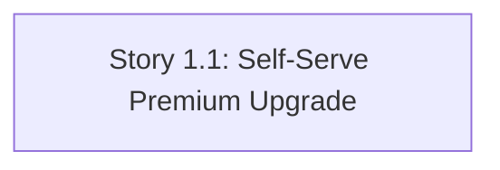

# aire State Tracking

## Project Information
- **Project Type**: Brownfield
- **Start Date**: 2026-09-17T11:47:27Z
- **Current Stage**: Design complete — awaiting dev-implement

## Workspace State
- **Existing Code**: Yes
- **Programming Languages**: Python (FastAPI backend), JavaScript/JSX (React 19 + Vite frontend)
- **Build System**: pip (backend), npm/Vite (frontend)
- **Project Structure**: Monolith (single backend service + single frontend SPA)
- **Workspace Root**: C:\Users\shailendra.yadav\Desktop\projects\helix-aire-v1-demo1\billing-cycle-copy
- **Reverse Engineering Needed**: No — Atlas deep dive pulled (see Existing-System Context below)
- **Reverse Engineering Artifacts**: spec/plans/atlas-deep-dive.md (pulled from Atlas)

## Code Location Rules
- **Application Code**: src/backend (Python/FastAPI), src/frontend (React/Vite) — already under src/, no Code Root remapping needed
- **Documentation**: spec/ only
- **Structure patterns**: See code-generation.md Critical Rules

## Tracker
- Type: LOCAL
- Parent Epic: Self-Serve Premium Upgrade (sourced from Atlas via Helix MCP, not a formal tracker key)
- Epic URL: — (Helix solution document_id 4039)
- Project Key / Repo / Org: —

## Existing-System Context
- **Workspace type**: brownfield
- **Helix MCP**: connected
- **Source**: atlas
- **Components in scope**: Whole estate (single deep dive document covers the entire repo — Billing-Cycle backend + frontend)
- **Atlas deep dive doc**: spec/plans/atlas-deep-dive.md
- **Recorded**: 2026-09-17T11:47:27Z

## Helix MCP Binding
- **Server**: helix
- **Docs tool(s)**: mcp__helix__list_solution_documents_tool, mcp__helix__get_solution_document_tool — list/fetch solution documents (Epic, Deep Dive) from Atlas
- **Graph/Search tool(s)**: mcp__helix__document_chatbot_query, mcp__helix__codebase_agent_query, mcp__helix__codebase_cypher_query — targeted documentation/code queries (not yet used)
- **Estate / workspace id**: solution_id 951 ("Billing-Cycle-Helix-Workshop")
- **Resolved**: 2026-09-17T11:47:27Z

## Branching
- Base Branch: main
- Epic Branch: epic/self-serve-premium-upgrade
- Epic PR: (not raised — raised manually at cycle end via pr-generator)

## Context Project
- **Existing Knowledge**: No
- **Existing Knowledge Path(s)**: —
- **New References**: No
- **New Reference Path(s)**: —

## CI/CD Configuration
- Enabled: No
- Source: user opt-out

## Extension Configuration
| Extension | Enabled | Decided At |
|---|---|---|
| Security Baseline | Yes (always mandatory) | — |
| Playwright Test Automation | Yes (always mandatory) | — |
| Resiliency Baseline | No | Requirements Analysis |
| Property-Based Testing | No | Requirements Analysis |

## Story Planning
- team_size: 2 (fixed default, never asked)
- story_creation_mode: all-at-once (fixed default, never asked)
- target_story_count: 1, requested by user 4 times; initially auto-split to 5 by Step 18.6 (compliant draft), then RE-MERGED to 1 per explicit, repeated, informed user override (recorded exception in stories.md) — see runtime-artifacts/audit.md for the full decision trail

## Story Tracker

| Story | Title | Requires | Tracker ID | Status | PR | Merged | Start | End | Recorded |
|-------|-------|----------|------------|--------|----|--------|-------|-----|----------|
| 1.1 | Self-Serve Premium Upgrade | none | LOCAL | 🟢 Ready for Development | — | — | | | 2026-09-17 12:32 |

## Dependency Graph
- **Total stories**: 1 | **Immediately startable (no prerequisites)**: 1
- **team_size**: 2 (target: ≥2 independent stories available at a time — NOT met; single-story set is a recorded exception per the User Stories override, so no parallelism is possible this cycle)
- **Inferred edges**: none — Story 1.1 has no prerequisites (it is the only story)

## Stage Progress
- [x] Workspace Detection
- [x] Reverse Engineering — SKIPPED (Atlas deep dive found and pulled)
- [x] Requirements Analysis — approved 2026-09-17T12:10:00Z
- [x] User Stories — GATE 1 approved 2026-09-17T12:32:00Z (single story, recorded exception to Step 18.6)
- [x] Dependency Graph — trivial (1 story, no edges)
- [x] Workflow Planning — see spec/plans/executions.md
- [ ] Application Design — SKIP (no new components, within existing boundaries)

### IMPLEMENTATION PHASE
- [x] Functional Design — approved 2026-09-17T12:42:00Z (spec/plans/functional-design.md)
- [ ] NFR Requirements — SKIP (NFRs already fully specified in requirements.md)
- [ ] NFR Design — SKIP (depends on NFR Requirements, skipped)
- [x] Infrastructure Design — SKIP (no infra changes)
- [ ] Code Generation — EXECUTE (ALWAYS, via dev-implement) — awaiting `dev-implement`

## STOP CHECKPOINT
- spec/behavior.feature: written — no cross-story journeys (single-story cycle)
- spec/plans/architecture.md: v1.0.0 written, 7 Section 10 constraints (weights sum 1.0)
- tests/.evals/config.json: created (2 roots — src/backend python, src/frontend node)
- tests/.evals/rubrics/architecture-rubric.json: v1.0.0, 7 criteria
- tests/.evals/rubrics/security-rubric.json: v1.0.0, 7 OWASP criteria (A05/A08/A09 excluded, genuinely inapplicable)
- CI pipeline: NOT generated (user opted out — ## CI/CD Configuration Enabled: No)
- Epic-level smoke test: SKIPPED (no CI to smoke-test)
- [ ] Dependency Graph
- [ ] Workflow Planning
- [ ] Application Design
