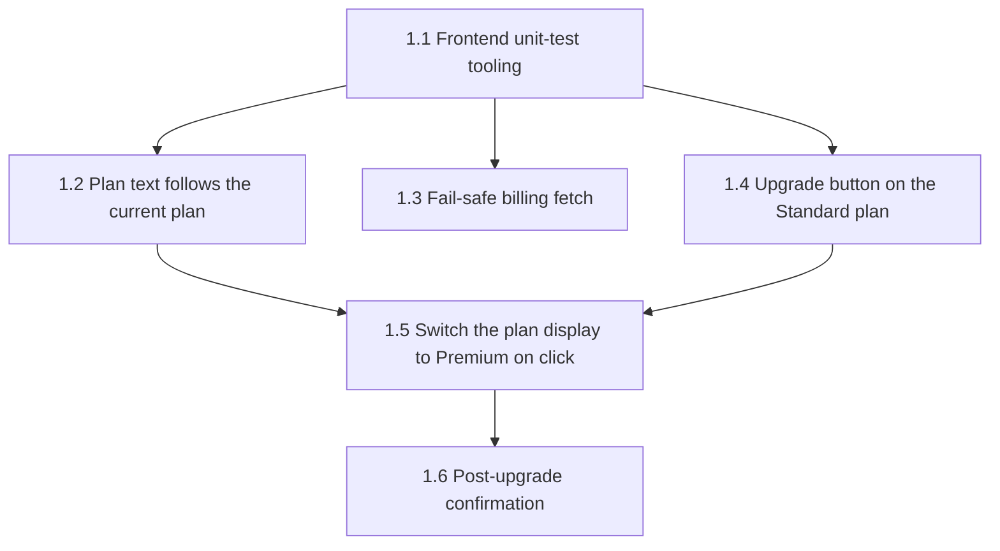

# aire State Tracking

## Project Information
- **Project Type**: Brownfield
- **Start Date**: 2026-10-27T13:49:14Z
- **Current Stage**: Design complete — awaiting dev-implement
- **team_size**: 2 (fixed default, not asked)
- **story_creation_mode**: all-at-once (fixed default, not asked)
- **target_story_count**: 6 (recommended, accepted)
- **Workflow Type**: epic
- **AIRE Framework Version**: 1.0

## Tracker
- Type: LOCAL
- Parent Epic: HELIX-7344 (Atlas Epic document 7344 — "Epic: Premium Upgrade Demo (Frontend Only)")
- Epic URL: —
- Project Key / Repo / Org: —
- Epic Content Source: Helix MCP (user-directed) — spec/plans/epic-brief.md

## Workspace State
- **Existing Code**: Yes
- **Programming Languages**: Python (backend), JavaScript/JSX (frontend)
- **Build System**: pip (src/backend/requirements.txt), npm (src/frontend/package.json)
- **Project Structure**: Monolith — FastAPI API + React SPA in one repo
- **Workspace Root**: C:\Users\shailendra.yadav\Desktop\projects\helix-aire-v1-demo1\billing-cycle-copy
- **Reverse Engineering Needed**: No — Atlas deep dive pulled (Reverse Engineering SKIPPED)
- **Reverse Engineering Artifacts**: spec/plans/atlas-deep-dive.md

## Code Location Rules
- **Application Code**: src/ (existing code already under src/ — no Code Root override)
- **Documentation**: spec/ only
- **Structure patterns**: See code-generation.md Critical Rules

## Helix MCP Binding
- **Server**: helix
- **Docs tool(s)**: list_solution_documents_tool, get_solution_document_tool — list and fetch Atlas solution documents (Epic, deep dive)
- **Graph/Search tool(s)**: codebase_agent_query, codebase_cypher_query, document_chatbot_query, graph_change_impact — targeted relationship/doc questions for inline answers
- **Docs write tool(s)**: save_solution_document_tool — create (parent_registry_id + visibility_intent user_team) / replace by document_id
- **Estate / workspace id**: Billing-Cycle-Helix-Workshop (solution_id 951), repository Billing-Cycle @ main, last_ingested_commit 69f67f308492a85648aa25a9ff7d8d574031344a
- **Resolved**: 2026-10-27T13:50:18Z

## Atlas Artifact Sync
- Enabled: Yes
- Source: user opt-in
- Cycle Folder: HELIX-7344-premium-upgrade-demo-frontend-only (doc 7816)
- Decided At: 2026-10-27T13:54:32Z

### Synced Files
| Path | Doc ID | Synced At |
|------|--------|-----------|
| ./ | 7816 | 2026-10-27T13:54:32Z |
| spec/ | 7817 | 2026-10-27T13:54:32Z |
| spec/plans/ | 7820 | 2026-10-27T13:54:32Z |
| spec/spec-generation/ | 7821 | 2026-10-27T13:54:32Z |
| spec/behavior/ | 7822 | 2026-10-27T13:54:32Z |
| spec/test-plans/ | 7823 | 2026-10-27T13:54:32Z |
| spec/playwright-specs/ | 7824 | 2026-10-27T13:54:32Z |
| runtime-artifacts/ | 7818 | 2026-10-27T13:54:32Z |
| runtime-artifacts/stories/ | 7825 | 2026-10-27T13:54:32Z |
| reports/ | 7819 | 2026-10-27T13:54:32Z |
| reports/unit-test-evidence/ | 7826 | 2026-10-27T13:54:32Z |
| reports/behavior-test-evidence/ | 7827 | 2026-10-27T13:54:32Z |
| reports/api-contract-test-evidence/ | 7828 | 2026-10-27T13:54:32Z |
| reports/playwright-test-evidence/ | 7829 | 2026-10-27T13:54:32Z |
| reports/eval-evidence/ | 7830 | 2026-10-27T13:54:32Z |
| reports/reviews/ | 7831 | 2026-10-27T13:54:32Z |
| reports/code-security-reviews/ | 7832 | 2026-10-27T13:54:32Z |
| reports/ticket-summary/ | 7833 | 2026-10-27T13:54:32Z |
| reports/pr-feedback/ | 7834 | 2026-10-27T13:54:32Z |
| spec/plans/epic-brief.md | 7835 | 2026-10-27T14:11:50Z |
| spec/plans/requirements.md | 7837 | 2026-10-27T14:11:50Z |
| spec/spec-generation/requirement-verification-questions.md | 7838 | 2026-10-27T14:11:50Z |
| spec/plans/atlas-deep-dive.md | 7839 | 2026-10-27T14:11:50Z |
| runtime-artifacts/aire-state.md | 7840 | 2026-10-27T15:09:08Z |
| runtime-artifacts/audit.md | 7841 | 2026-10-27T15:09:08Z |
| spec/plans/stories.md | 7842 | 2026-10-27T14:23:50Z |
| spec/plans/personas.md | 7843 | 2026-10-27T14:23:50Z |
| spec/plans/dependency-graph.yml | 7844 | 2026-10-27T14:23:50Z |
| spec/spec-generation/story-generation.md | 7845 | 2026-10-27T14:23:50Z |
| spec/plans/architecture.md | 7852 | 2026-10-27T15:05:10Z |
| spec/plans/executions.md | 7856 | 2026-10-27T15:05:10Z |
| spec/behavior.feature | 7861 | 2026-10-27T15:05:10Z |
| spec/behavior/story-1.1.feature | 7862 | 2026-10-27T15:05:10Z |
| spec/behavior/story-1.2.feature | 7866 | 2026-10-27T15:05:10Z |
| spec/behavior/story-1.3.feature | 7867 | 2026-10-27T15:05:10Z |
| spec/behavior/story-1.4.feature | 7868 | 2026-10-27T15:05:10Z |
| spec/behavior/story-1.5.feature | 7869 | 2026-10-27T15:05:10Z |
| spec/behavior/story-1.6.feature | 7870 | 2026-10-27T15:05:10Z |
| spec/test-plans/story-1.1-frontend-unit-test-tooling/ | 7846 | 2026-10-27T15:05:10Z |
| spec/test-plans/story-1.1-frontend-unit-test-tooling/integration-test-steps.md | 7853 | 2026-10-27T15:05:10Z |
| spec/test-plans/story-1.1-frontend-unit-test-tooling/security-test-steps.md | 7854 | 2026-10-27T15:05:10Z |
| spec/test-plans/story-1.1-frontend-unit-test-tooling/test-plan-summary.md | 7855 | 2026-10-27T15:05:10Z |
| spec/test-plans/story-1.2-plan-text-follows-the-current-plan/ | 7847 | 2026-10-27T15:05:10Z |
| spec/test-plans/story-1.2-plan-text-follows-the-current-plan/accessibility-test-steps.md | 7857 | 2026-10-27T15:05:10Z |
| spec/test-plans/story-1.2-plan-text-follows-the-current-plan/e2e-test-steps.md | 7858 | 2026-10-27T15:05:10Z |
| spec/test-plans/story-1.2-plan-text-follows-the-current-plan/integration-test-steps.md | 7859 | 2026-10-27T15:05:10Z |
| spec/test-plans/story-1.2-plan-text-follows-the-current-plan/test-plan-summary.md | 7860 | 2026-10-27T15:05:10Z |
| spec/test-plans/story-1.3-fail-safe-billing-fetch/ | 7848 | 2026-10-27T15:05:10Z |
| spec/test-plans/story-1.3-fail-safe-billing-fetch/integration-test-steps.md | 7863 | 2026-10-27T15:05:10Z |
| spec/test-plans/story-1.3-fail-safe-billing-fetch/security-test-steps.md | 7864 | 2026-10-27T15:05:10Z |
| spec/test-plans/story-1.3-fail-safe-billing-fetch/test-plan-summary.md | 7865 | 2026-10-27T15:05:10Z |
| spec/test-plans/story-1.4-upgrade-button-on-the-standard-plan/ | 7849 | 2026-10-27T15:05:10Z |
| spec/test-plans/story-1.4-upgrade-button-on-the-standard-plan/accessibility-test-steps.md | 7871 | 2026-10-27T15:05:10Z |
| spec/test-plans/story-1.4-upgrade-button-on-the-standard-plan/e2e-test-steps.md | 7872 | 2026-10-27T15:05:10Z |
| spec/test-plans/story-1.4-upgrade-button-on-the-standard-plan/integration-test-steps.md | 7873 | 2026-10-27T15:05:10Z |
| spec/test-plans/story-1.4-upgrade-button-on-the-standard-plan/test-plan-summary.md | 7874 | 2026-10-27T15:05:10Z |
| spec/test-plans/story-1.5-switch-the-plan-display-to-premium-on-click/ | 7850 | 2026-10-27T15:05:10Z |
| spec/test-plans/story-1.5-switch-the-plan-display-to-premium-on-click/e2e-test-steps.md | 7875 | 2026-10-27T15:05:10Z |
| spec/test-plans/story-1.5-switch-the-plan-display-to-premium-on-click/integration-test-steps.md | 7876 | 2026-10-27T15:05:10Z |
| spec/test-plans/story-1.5-switch-the-plan-display-to-premium-on-click/security-test-steps.md | 7877 | 2026-10-27T15:05:10Z |
| spec/test-plans/story-1.5-switch-the-plan-display-to-premium-on-click/test-plan-summary.md | 7878 | 2026-10-27T15:05:10Z |
| spec/test-plans/story-1.6-post-upgrade-confirmation/ | 7851 | 2026-10-27T15:05:10Z |
| spec/test-plans/story-1.6-post-upgrade-confirmation/accessibility-test-steps.md | 7879 | 2026-10-27T15:05:10Z |
| spec/test-plans/story-1.6-post-upgrade-confirmation/e2e-test-steps.md | 7880 | 2026-10-27T15:05:10Z |
| spec/test-plans/story-1.6-post-upgrade-confirmation/test-plan-summary.md | 7881 | 2026-10-27T15:05:10Z |

### Pending
| Path | Reason |
|------|--------|
| runtime-artifacts/aire-state.md | Helix MCP unreachable at 2026-10-28T09:58:10Z (edit and read calls both returned 'Request could not be completed'); retry at next pass |
| runtime-artifacts/audit.md | Helix MCP unreachable at 2026-10-28T09:58:10Z (edit and read calls both returned 'Request could not be completed'); retry at next pass |

## Context Project
- **Existing Knowledge**: No
- **Existing Knowledge Path(s)**: —
- **New References**: No
- **New Reference Path(s)**: —

## Design References
| # | Path / Location | Type | Governs | Read? | Read At Stage |
|---|-----------------|------|---------|-------|---------------|

## Existing-System Context
- **Workspace type**: brownfield
- **Helix MCP**: connected
- **Source**: atlas
- **Components in scope**: frontend Billing page (src/frontend/src/pages/Billing.jsx), frontend styles (src/frontend/src/App.css), read-only backend GET /api/billing contract (src/backend/main.py)
- **Atlas deep dive doc**: spec/plans/atlas-deep-dive.md
- **Recorded**: 2026-10-27T13:52:14Z

## Branching
- Base Branch: main
- Epic Branch: epic/HELIX-7344-premium-upgrade-demo-frontend-only
- Epic PR: (not raised — raised manually at cycle end via pr-generator)

## CI/CD Configuration
- Enabled: No
- Source: user opt-out
- Decided At: 2026-10-27T14:44:13Z
- Effect: STOP CHECKPOINT Steps 1.6 (pipeline generation) and 4 (epic smoke test) skipped; no agentic-eval-pipeline.yml, no sonar-project.properties, no tests/.evals/scripts/*

## Extension Configuration
| Extension | Enabled | Decided At |
|---|---|---|
| Security Baseline | Yes (always enforced) | Workspace Detection |
| UI/UX Mockups | No | Requirements Analysis |
| Resiliency Baseline | No | Requirements Analysis |
| Property-Based Testing | No | Requirements Analysis |

## UI/UX Design
- **Mode**: skip
- **Provided design path(s)**: —
- **Decided At**: Requirements Analysis

## Story Tracker

| Story | Title | Requires | Tracker ID | Status | PR | Merged | Start | End | Recorded |
|-------|-------|----------|------------|--------|----|--------|-------|-----|----------|
| 1.1 | Frontend unit-test tooling | none | LOCAL | Ready for Development | — | — | | | 2026-10-27T14:19:58Z |
| 1.2 | Plan text follows the current plan | 1.1 | LOCAL | Ready for Development | — | — | | | 2026-10-27T14:19:58Z |
| 1.3 | Fail-safe billing fetch | 1.1 | LOCAL | Ready for Development | — | — | | | 2026-10-27T14:19:58Z |
| 1.4 | Upgrade button on the Standard plan | 1.1 | LOCAL | Ready for Development | — | — | | | 2026-10-27T14:19:58Z |
| 1.5 | Switch the plan display to Premium on click | 1.2, 1.4 | LOCAL | Ready for Development | — | — | | | 2026-10-27T14:19:58Z |
| 1.6 | Post-upgrade confirmation | 1.5 | LOCAL | Ready for Development | — | — | | | 2026-10-27T14:19:58Z |

## Architecture
- **architecture.md**: spec/plans/architecture.md v1.0.0 (assembled from Atlas truth + approved requirements/stories; all design stages skipped)
- **Verifiable constraints**: 6 (ARCH-01..ARCH-06, weights sum 1.0)
- **architecture-rubric.json**: tests/.evals/rubrics/architecture-rubric.json v1.0.0 (6 criteria, derived mechanically from Section 10)
- **security-rubric.json**: tests/.evals/rubrics/security-rubric.json v1.0.0 (8 OWASP Top 10:2025 criteria; A04, A08 excluded)
- **config.json**: tests/.evals/config.json created (template thresholds; roots src/frontend node 22.14.0, src/backend python 3.13)
- **Cross-unit journeys**: spec/behavior.feature (3 scenarios)
- **Recorded**: 2026-10-27T14:54:17Z

## Behaviour Specs & Test Plans
- **Work units covered**: 6
- **Behaviour contracts**: spec/behavior/ — 6 file(s), 30 scenarios
- **Manual test plans**: spec/test-plans/ — 6 folder(s), 46 test cases
- **AC coverage**: 24/24 (scenarios) · 24/24 (test cases)
- **Approved**: 2026-10-27T14:57:30Z

## Requirements Coverage
- Requirements coverage verified post-design: 21/21 REQ-IDs — 2026-10-27T14:26:56Z (all design stages skipped; no design artifact refined or contradicted a story AC)

## Dependency Graph

Generated 2026-10-27T14:19:58Z (auto-generated, no approval gate). Source: `spec/plans/dependency-graph.yml`.

```mermaid
graph TD
    S1_1["1.1 Frontend unit-test tooling"]
    S1_2["1.2 Plan text follows the current plan"]
    S1_3["1.3 Fail-safe billing fetch"]
    S1_4["1.4 Upgrade button on the Standard plan"]
    S1_5["1.5 Switch the plan display to Premium on click"]
    S1_6["1.6 Post-upgrade confirmation"]
    S1_1 --> S1_2
    S1_1 --> S1_3
    S1_1 --> S1_4
    S1_2 --> S1_5
    S1_4 --> S1_5
    S1_5 --> S1_6
```

Text alternative: 1.1 first; then 1.2, 1.3 and 1.4 in parallel; 1.5 after 1.2 and 1.4; 1.6 after 1.5.

**Ready now**: 1.1 (no prerequisites).
**Blocked**: 1.2, 1.3, 1.4 by 1.1 | 1.5 by 1.2 and 1.4 | 1.6 by 1.5.
**Parallelism**: once 1.1 merges, 3 stories (1.2, 1.3, 1.4) are available at once (>= team_size 2). Only one story is startable at the very beginning because 1.1 is the R1 seed for the test tooling.

| Edge | Justification |
|---|---|
| 1.2 requires 1.1 | R1: its unit tests need the Vitest/RTL/jsdom setup 1.1 creates |
| 1.3 requires 1.1 | R1: its unit tests need the Vitest/RTL/jsdom setup 1.1 creates |
| 1.4 requires 1.1 | R1: its unit tests need the Vitest/RTL/jsdom setup 1.1 creates; reads plan_name directly, so no edge to 1.2 (R4) |
| 1.5 requires 1.2 | R2: AC-1 relies at runtime on the plan-text rule from 1.2 |
| 1.5 requires 1.4 | R2: the click handler is wired onto the button 1.4 renders |
| 1.6 requires 1.5 | R2: banner and hidden button react to the post-upgrade state 1.5 introduces |

**Shared files** (rebase before merge when built in parallel): src/frontend/src/pages/Billing.jsx, src/frontend/src/App.css, the Billing page unit test file.

## Stage Progress
- [x] Workspace Detection — state check, tracker selection, Parent Epic capture (Helix), code scan, Helix MCP gate, Epic branch, context folders
- [x] Workspace Detection — Atlas Artifact Sync opt-in (Yes), Context opt-in (1 no, 2 no), design reference guardrail loaded
- [x] Reverse Engineering — SKIPPED (Atlas deep dive found and pulled)
- [x] Requirements Analysis — depth Standard; spec/plans/requirements.md v1 (REQ-F-01..12, REQ-NF-01..09) approved 2026-10-27T14:04:48Z
- [x] User Stories — 6 stories (spec/plans/stories.md, personas.md); GATE 1 approved 2026-10-27T14:19:58Z; Part 3 push skipped by design (Type: LOCAL, Tracker ID LOCAL)
- [x] Dependency Graph — spec/plans/dependency-graph.yml (auto, no gate)
- [x] Workflow Planning — spec/plans/executions.md (auto-approved, no gate) 2026-10-27T14:26:56Z
- [x] Application Design — SKIPPED (changes within the existing Billing page component; no new components/services)

### IMPLEMENTATION PHASE
- [x] Functional Design — SKIPPED (no new data model; rules fully specified by REQ-F-01..12)
- [x] NFR Requirements — SKIPPED (stack determined; NFRs already REQ-NF-01..09)
- [x] NFR Design — SKIPPED (NFR Requirements skipped)
- [x] Infrastructure Design — SKIPPED (no infrastructure changes)
- [x] STOP CHECKPOINT — CI/CD opt-out; behavior.feature, architecture.md v1.0.0, rubrics + config, 6 contracts + 6 test plans approved; design commit f701edf pushed; smoke test skipped (CI/CD opt-out); Development Handoff presented 2026-10-27T15:09:34Z
- [ ] Code Generation — per story via dev-implement
