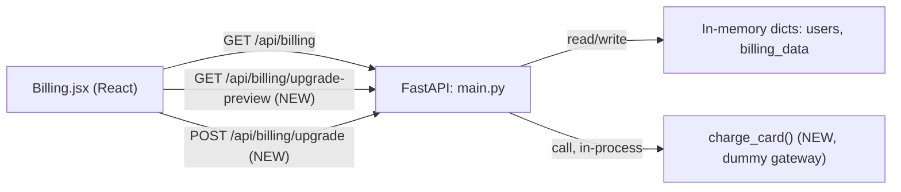

# Architecture — Billing-Cycle (Mid-Cycle Subscription Upgrade)

> **Version**: 1.0.0 · **Generated**: 2026-09-11T09:01:49Z · **AIRE**: v1.0
> **Derived from**: spec/plans/atlas-deep-dive.md, spec/plans/epic-brief.md, spec/plans/requirements.md, spec/plans/stories.md (no Functional/NFR/Infrastructure/Application Design stage ran — all SKIPPED per Workflow Planning; this document is assembled from the Atlas baseline and the Epic/requirements directly)
> **Existing-system baseline**: Atlas via Helix MCP — solution_id 874 (Billing-Cycle-AIRE-V1-Demo), repo Shailendrayadav0666/Billing-Cycle

## 1. System Context

A FastAPI backend (`src/backend/main.py`) serves an in-memory mock store (`users`, `billing_data`,
`tasks_data` — no real database) behind a small set of `/api/*` routes. A React (Vite) frontend
(`src/frontend`) calls those routes, using the user's **email as the bearer token** (`AuthContext.jsx`
stores it in `localStorage` and passes it as `?email=` on every call). The Billing page
(`Billing.jsx`) is the only consumer of `/api/billing*`.

This epic adds one new capability — a self-serve plan upgrade — entirely inside this existing
request/response shape. No new service, no new datastore, no external network call.

## 2. Component Inventory

| Component | Responsibility | Status | Source |
|---|---|---|---|
| `main.py` routes | HTTP surface for billing | existing (modified) | atlas-deep-dive.md |
| `charge_card()` | Deterministic dummy payment decision | new | epic-brief.md (Gateway Spec) |
| `PLANS` / `PREMIUM_QUOTAS` / `DAYS_IN_CYCLE` | Plan pricing + quota constants | new | epic-brief.md |
| `UpgradeRequest` (Pydantic) | Request contract for `POST /upgrade` | new | epic-brief.md |
| `Billing.jsx` | Plan display + upgrade CTA/modal | existing (modified) | atlas-deep-dive.md |

## 3. Layering and Boundaries

Single-layer FastAPI app: route handlers read/write the module-level dicts directly (no
repository/service layer exists in this codebase, and this epic does not introduce one). Proration
math and the gateway call live in plain functions called from the route handlers — never inline
duplicated in the frontend. The frontend never mutates plan/billing state itself; it only calls the
two new endpoints and re-renders whatever they return.

## 4. Data Architecture

No schema/migration — `users[email]` and `billing_data[email]` are plain dicts in process memory,
already shaped by the existing `main.py`. This epic adds no new store; it only writes new fields'
*values* (plan, price, usages, on_demand_usage.notice) into the existing shape on a successful
upgrade. No transaction boundary exists or is needed — a single Python request handler is single-
threaded per request against in-memory state.

## 5. API and Integration Contracts

| Endpoint | Method | Auth | Request | Success | Error |
|---|---|---|---|---|---|
| `/api/billing/upgrade-preview` | GET | `email` query param (existing pattern — no real auth) | `email: str` | 200 `{current_plan, new_plan, days_remaining, prorated_charge, next_renewal_price, renew_at}` | 401 unknown email; 409 `already_premium` |
| `/api/billing/upgrade` | POST | `email` in body | `UpgradeRequest{email: str}` | 200 `{status: "success", plan: "Premium", charge: float}` | 401 unknown email; 402 `card_declined`; 409 `already_premium` |

No external integration — `charge_card(email, amount) -> dict` is a pure in-process function, per
REQ-NF-01.

## 6. Cross-Cutting Decisions

- **AuthN/AuthZ**: unchanged — email-as-token, matching every existing endpoint. Not hardened further
  by this epic (explicitly out of scope: no changes to auth flows, REQ-NF-02).
- **Error model**: FastAPI `HTTPException` with a `detail` field, matching the existing
  `/api/auth/login` 401 pattern — this epic's 402/409 responses follow the same shape.
- **Server-side-only computation**: all proration math runs in the backend; the frontend is a pure
  renderer of API responses (REQ-NF-03).
- **No secrets**: the dummy gateway takes no credentials/tokens — it decides purely on the email
  string, so there is nothing secret to protect or log.

## 7. Non-Functional Targets

Not applicable beyond the existing POC's implicit targets — no NFR Requirements stage ran (small,
synchronous, in-memory operation; no perf/scale requirement was raised for this epic).

## 8. Infrastructure and Deployment

Unchanged — same FastAPI process, same Vite dev server / static build, no new infra.

## 9. Delta from the Existing System

| Area | Before (Atlas) | After | Reason |
|---|---|---|---|
| `main.py` | No upgrade path; plan fields exist but are never mutated post-registration | Two new endpoints + `charge_card()` mutate `users`/`billing_data` on upgrade | Epic goal — self-serve upgrade |
| `Billing.jsx` | Hardcoded `"Standard"` badge, static plan card, no CTA | Dynamic badge from `data.plan_name`, conditional CTA, confirmation modal | Epic Story requirements |

## 10. Verifiable Constraints

### ARCH-01 — Proration is server-side only
- **Constraint**: All proration/pricing arithmetic executes in `backend/main.py`; the frontend only displays values returned by the API.
- **Verifiable as**: `frontend/src/pages/Billing.jsx` (or any other frontend file touched) contains no arithmetic recomputing `prorated_charge`, `daily_delta`, or `days_remaining` from raw plan prices/dates. Score 0 if any such computation appears client-side.
- **Weight**: 0.30
- **Source**: requirements.md REQ-NF-03

### ARCH-02 — Deterministic dummy gateway, no external dependency
- **Constraint**: `charge_card(email, amount)` is a pure function with no network call, SDK import, or environment-variable-gated provider switch.
- **Verifiable as**: The diff introduces no new third-party payment package in `requirements.txt`/`package.json`, and `charge_card` contains no `requests`/`httpx`/socket call. Score 0 on any such addition.
- **Weight**: 0.25
- **Source**: requirements.md REQ-NF-01, epic-brief.md Gateway Specification

### ARCH-03 — No mutation on payment failure
- **Constraint**: `users` and `billing_data` are left byte-for-byte unchanged when `charge_card` returns `card_declined`.
- **Verifiable as**: The `POST /api/billing/upgrade` handler's declined branch contains no write to `users[email]` or `billing_data[email]` before returning the 402. Score 0 if any mutation precedes the decline check.
- **Weight**: 0.20
- **Source**: stories.md Story 1.1 AC7

### ARCH-04 — Already-Premium guard on both endpoints
- **Constraint**: Both `GET /upgrade-preview` and `POST /upgrade` reject an already-Premium caller with HTTP 409 before doing any proration or charge work.
- **Verifiable as**: Each handler's Premium check occurs before the proration calculation / `charge_card` call, not after. Score 0 if the guard is missing on either endpoint or placed after the side-effecting work.
- **Weight**: 0.15
- **Source**: stories.md Story 1.1 AC8

### ARCH-05 — `renew_at` immutability
- **Constraint**: The upgrade flow never writes to `users[email]["renew_at"]` or `billing_data[email]["renew_at"]`.
- **Verifiable as**: No assignment to a `renew_at` key appears anywhere in the diff's upgrade-handling code. Score 0 on any such assignment.
- **Weight**: 0.10
- **Source**: stories.md Story 1.1 AC6, epic-brief.md Acceptance Criteria — Epic Level

*(Weights: 0.30 + 0.25 + 0.20 + 0.15 + 0.10 = 1.00)*

## 11. Explicitly Out of Scope

Downgrades, refunds/credits, an Enterprise tier, real payment provider integration, email
receipts/notifications, a repository/service layer, a real database, and any change to auth, tasks,
login, or registration flows. See requirements.md REQ-NF-04.
