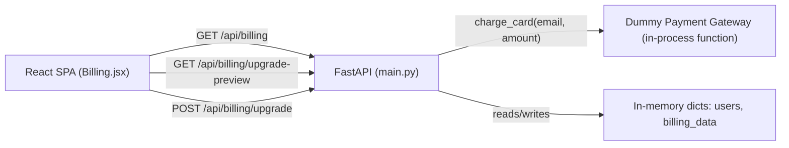

# Architecture — Billing-Cycle (Mid-Cycle Subscription Upgrade)

> **Version**: 1.0.0 · **Generated**: 2026-09-03T08:20:00Z · **AIRE**: v1.0
> **Derived from**: spec/plans/deep-dive.md (Atlas), spec/plans/epic-brief.md (Atlas), spec/plans/requirements.md, spec/plans/stories.md
> **Existing-system baseline**: Atlas via Helix MCP — solution_id 874 ("Billing-Cycle-AIRE-V1-Demo"), repo https://github.com/Shailendrayadav0666/Billing-Cycle
>
> **Note on the System-Level DESIGN stages**: Functional Design, NFR Requirements, NFR Design, and Infrastructure Design were all SKIPPED at Workflow Planning (see `spec/plans/executions.md`) — the Epic/requirements/story already fully specify the one piece of non-trivial business logic (proration), the tech stack is fixed, and there are no infrastructure changes. This document is therefore assembled directly from Atlas truth + requirements.md + stories.md rather than from those (absent) design artifacts, per Section 1 of `implementation/architecture-doc.md`.

## 1. System Context

Billing-Cycle is a single-process POC: a React 19 + Vite SPA calls a FastAPI backend over 6 (soon 8) REST endpoints via a dev proxy / static-file serving in production. All state lives in two in-memory Python dicts (`users`, `billing_data`) — no database. Authentication is email-as-bearer-token: the frontend stores the logged-in user's email as `token` and sends it on every call; the backend uses it directly as the dict key.

This epic adds two new endpoints and one new pure function to the existing backend module, and extends the existing Billing page with a CTA, a modal, and success/error UI — no new services, processes, or external integrations.

## 2. Component Inventory

| Component | Responsibility | Status | Source |
|---|---|---|---|
| `Billing.jsx` (frontend page) | Renders plan/usage, CTA, upgrade modal, success/error states | existing (modified) | Atlas deep-dive.md; stories.md Story 1 |
| `main.py` billing section | Existing `/api/billing`, `/api/tasks`; new upgrade-preview/upgrade endpoints | existing (modified) | Atlas deep-dive.md; stories.md Story 1 |
| `charge_card()` | Deterministic dummy payment gateway (pure function, in-process) | new | epic-brief.md Dummy Payment Gateway Spec |
| `AuthContext.jsx` | Holds the email-as-token session identity | existing (unmodified, read-only reference) | Atlas deep-dive.md |

## 3. Layering and Boundaries

Two layers only, matching the existing POC: **frontend page components** (React, call the API via `fetch`/proxy) and **backend route handlers** (FastAPI functions in `main.py`, operate directly on the module-level `users`/`billing_data` dicts — there is no repository/service layer in this codebase to preserve or violate). `charge_card()` is a plain function called only from the `POST /api/billing/upgrade` handler — it must not be called from, or duplicated into, the frontend. The frontend never computes proration or gateway outcomes itself (REQ-NF-01, REQ-NF-02).

## 4. Data Architecture

No new store, no schema migration (no database exists). `billing_data[email]` and `users[email]` are extended with values already fully specified in `requirements.md`/`stories.md` (Premium price/label, Premium quotas, updated `on_demand_usage.notice`). `renew_at` is read-only input to the proration calculation and MUST NOT be mutated by the upgrade. All mutation is a single in-process dict write per request — no transaction boundary exists or is needed at this scale (accepted POC limitation, REQ-NF-05).

## 5. API and Integration Contracts

| Endpoint | Method | Auth | Success | Error(s) |
|---|---|---|---|---|
| `/api/billing/upgrade-preview` | GET | email query param (existing pattern) | 200 `{current_plan, new_plan, days_remaining, prorated_charge, next_renewal_price, renew_at}` | 409 `{"detail":"already_premium"}` |
| `/api/billing/upgrade` | POST | `{"email": str}` body | 200 `{"status":"success","plan":"Premium","charge":<amount>}` | 402 `{"detail":"card_declined","message":"..."}`; 409 `{"detail":"already_premium"}` |

No new external integration — `charge_card()` is entirely in-process and deterministic (no network call, no SDK, no secret).

## 6. Cross-Cutting Decisions

- **AuthN/AuthZ**: unchanged — email-as-token, no new auth logic introduced or required by this epic.
- **Error handling**: FastAPI `HTTPException` with a JSON `detail` body, matching the existing convention already used elsewhere in `main.py` (REQ-NF-04).
- **Logging**: no new logging requirement; no card data or secrets exist to redact (the gateway is a dummy function, not a real payment integration).
- **Configuration/secrets**: none — no API keys, no environment variables introduced.
- **Concurrency/idempotency**: out of scope for this POC — the in-memory store has no concurrency control today and this epic does not change that (accepted, REQ-NF-05).

## 7. Non-Functional Targets

| Concern | Target | Source | How it is verified |
|---|---|---|---|
| No new runtime dependency | 0 new pip/npm packages | REQ-NF-03 | Diff of `requirements.txt` / `package.json` in code review |
| Deterministic gateway | Same email prefix always yields the same outcome | REQ-NF-02 | Unit test + Gherkin scenarios (success and declined) |
| Server-side-only proration math | Frontend renders API values only, never recomputes | REQ-NF-01 | Code review of `Billing.jsx` diff — no proration formula in frontend code |

## 8. Infrastructure and Deployment

Unchanged — single FastAPI process, Vite dev server in development / static build served by FastAPI in production. No new deployment target, no new cloud resource, no containerization change beyond the existing (none).

## 9. Delta from the Existing System

| Area | Before (Atlas) | After | Reason |
|---|---|---|---|
| `main.py` | 6 endpoints, no upgrade path | 8 endpoints (+`GET /upgrade-preview`, +`POST /upgrade`), +`charge_card()`, +`PLANS`/`PREMIUM_QUOTAS`/`DAYS_IN_CYCLE` constants | Epic: self-serve mid-cycle upgrade |
| `Billing.jsx` | Static "Standard" badge, no CTA | Dynamic plan badge/price, conditional CTA, upgrade modal, success/error states | Epic Story 1 |

## 10. Verifiable Constraints

### ARCH-01 — Server-side-only proration
- **Constraint**: All proration arithmetic (days-remaining, daily delta, prorated charge) executes in `backend/main.py`; the frontend only renders values returned by the API.
- **Verifiable as**: No changed line in `frontend/src/pages/Billing.jsx` performs a proration calculation (subtraction/division/multiplication combining plan prices or a `renew_at` date). Score 0 if any such computation appears in the frontend diff.
- **Weight**: 0.25
- **Source**: spec/plans/requirements.md REQ-NF-01

### ARCH-02 — Deterministic gateway, no external call
- **Constraint**: `charge_card(email, amount)` is a pure, in-process function with no network call, SDK import, or environment secret.
- **Verifiable as**: The `charge_card` implementation contains no `requests`/`httpx`/`urllib` call, no new pip dependency import, and no `os.environ` read. Score 0 if any of these appear.
- **Weight**: 0.20
- **Source**: spec/plans/epic-brief.md Dummy Payment Gateway Spec; REQ-F-09, REQ-NF-02

### ARCH-03 — Declined payment mutates nothing
- **Constraint**: When `charge_card` returns `card_declined`, the `POST /api/billing/upgrade` handler must not write to `users[email]` or `billing_data[email]` before returning the 402 response.
- **Verifiable as**: In the diff, the mutation statements for `users`/`billing_data` are reachable only in the branch where `charge_card` returned `success`. Score 0 if any mutation statement executes (or is reachable) before the success check.
- **Weight**: 0.20
- **Source**: spec/plans/stories.md AC-7; REQ-F-13

### ARCH-04 — Already-Premium guard on both endpoints
- **Constraint**: Both `GET /api/billing/upgrade-preview` and `POST /api/billing/upgrade` return HTTP 409 `{"detail": "already_premium"}` and perform no mutation when the caller's `plan_name` is already `"Premium"`.
- **Verifiable as**: Each handler's diff contains an early guard clause checking `plan_name == "Premium"` before any proration or mutation logic runs. Score 0 if either handler lacks this guard.
- **Weight**: 0.20
- **Source**: spec/plans/stories.md AC-8; REQ-F-16

### ARCH-05 — No scope creep into unrelated endpoints
- **Constraint**: No changed line touches `/api/auth/login`, `/api/auth/register`, `/api/users/me`, `/api/tasks`, or `AuthContext.jsx`'s token logic.
- **Verifiable as**: The diff contains no hunk inside those four endpoint functions or that file. Score 0 if any such hunk exists.
- **Weight**: 0.15
- **Source**: spec/plans/requirements.md REQ-F-18; epic-brief.md Out of Scope

**Weights**: 0.25 + 0.20 + 0.20 + 0.20 + 0.15 = 1.00

## 11. Explicitly Out of Scope

Downgrades (Premium → Standard), refunds/credits, an Enterprise tier, real payment provider integration (Stripe, Braintree, etc.), email receipts/notifications, a database/persistence layer, and any authentication change. None of these should be added speculatively by this epic's implementation.
