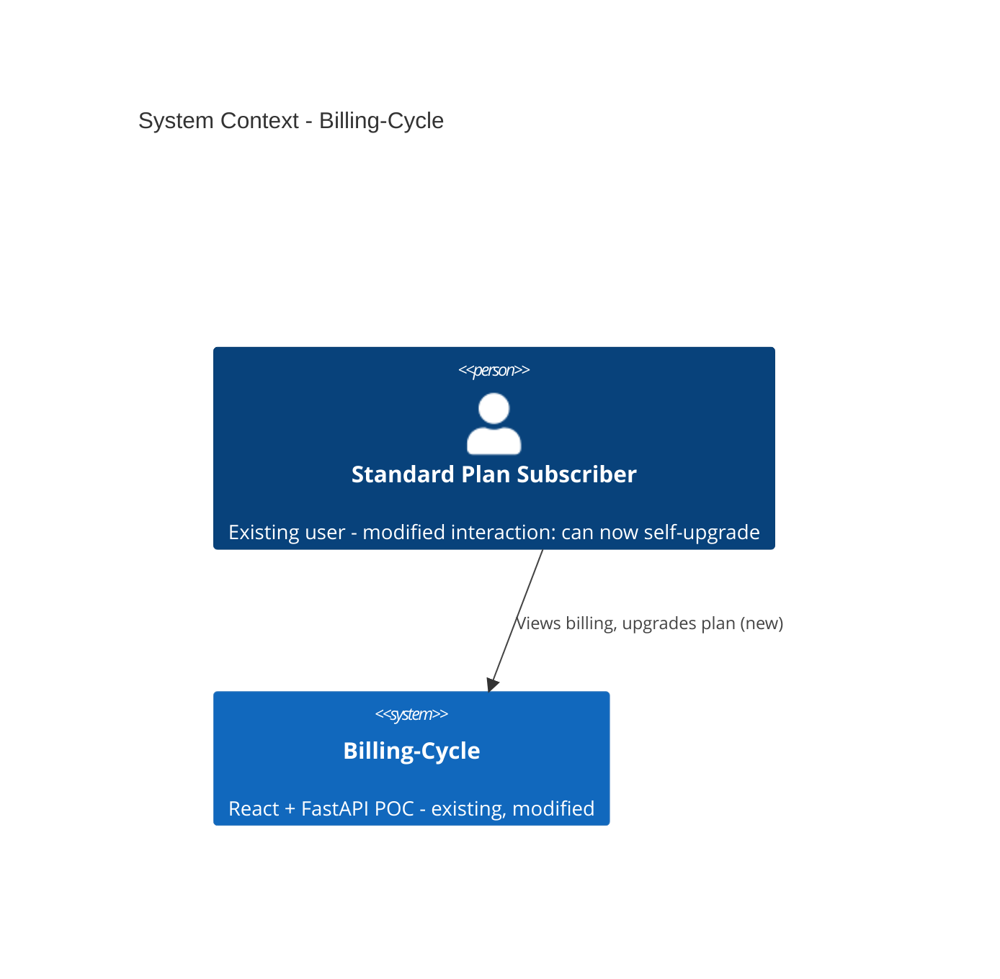
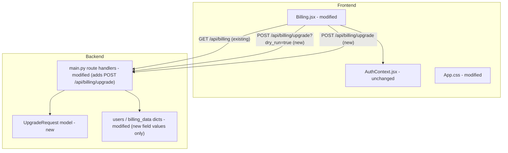

# Architecture — Billing-Cycle

> **Version**: 1.0.0 · **Generated**: 2026-09-17T12:45:00Z · **AIRE**: v1.0
> **Derived from**: spec/plans/functional-design.md, spec/plans/requirements.md, spec/plans/stories.md, spec/plans/atlas-deep-dive.md, spec/plans/epic-brief.md
> **Existing-system baseline**: Atlas via Helix MCP — solution_id 951 ("Billing-Cycle-Helix-Workshop"), repo `Shailendrayadav0666/Billing-Cycle`

## 1. System Context

Billing-Cycle is a single-process client-server SPA: a React 19 frontend talks to a FastAPI backend
over REST; the backend holds all state in three in-memory Python dicts (no database). This Epic adds
one new capability — a self-serve mid-cycle plan upgrade — entirely within that existing shape. No new
external system, no new deployment topology.



No external systems are called by this system (`atlas-deep-dive.md` "External Service Integrations:
None") and this Epic does not introduce one — the "payment" for the upgrade is mocked/simulated per
the Epic's explicit Out-of-Scope.

## 2. Component Inventory

| Component | Responsibility | Status | Source |
|---|---|---|---|
| `Billing.jsx` | Billing dashboard UI; now also the upgrade CTA, confirmation panel, and commit wiring | existing (modified) | atlas-deep-dive.md, functional-design.md Section 5 |
| `App.css` | Styles; new `.premium-badge`/`.upgrade-btn`/`.upgrade-confirm-panel` classes | existing (modified) | epic-brief.md |
| `AuthContext.jsx` | Auth state (token = email) | existing (unchanged) | atlas-deep-dive.md |
| `main.py` | FastAPI app: routes, models, in-memory store, CORS, static serving; now also the upgrade endpoint | existing (modified) | atlas-deep-dive.md, functional-design.md Sections 1-4 |
| `UpgradeRequest` (Pydantic model) | Validates the new endpoint's request body (`email: EmailStr`) | new | functional-design.md Section 1 |
| `users` / `billing_data` dicts | In-memory store | existing (modified — new field VALUES only, no new schema) | functional-design.md Section 1 |



## 3. Layering and Boundaries

The existing system has **no separate service or repository layer** — `main.py`'s route handlers
directly perform business logic and directly mutate the in-memory dicts (`atlas-deep-dive.md`
"Monolithic Backend" anti-pattern). **This Epic follows that existing convention rather than
introducing a new layer for a single endpoint** — Application Design was explicitly skipped in
Workflow Planning for this reason. The forbidden move is the opposite one: do not extract a new
`routes/`/`services/`/`store.py` split as part of this story (that refactor, if ever done, is a
separate future initiative per the Deep Dive's own recommendations — not bundled into this feature).

## 4. Data Architecture

No new store and no new schema. `users[email]` and `billing_data[email]` gain new **values** for
existing fields (`plan`, `price`, `usages[].limit`, `on_demand_usage.notice`) — no new keys, no new
entity types. No ER diagram is included per `common/behavior-spec.md`/`architecture-doc.md` Section
2.1's own rule ("when the work introduces or changes any store/schema") — this work changes neither.

## 5. API and Integration Contracts

**New**: `POST /api/billing/upgrade` (optional `?dry_run=true` query param)

- **Request**: `{"email": string}` (Pydantic `UpgradeRequest`, `email: EmailStr`)
- **Success response** (both `dry_run` and commit, same shape):
  ```json
  {"success": true, "prorated_charge": <float>, "new_plan": "Premium", "effective_from": <date>, "renew_at": <date>}
  ```
- **Error responses**: `401` (unknown email), `400 {"detail": "Already on Premium plan"}` (idempotency), `422` (malformed body, FastAPI/Pydantic default)
- **Auth model**: email-as-token, identical to the existing 6 endpoints — see Section 6 for the recorded exception on this point.
- **Versioning**: none — matches the existing API's lack of versioning.

No other contract changes. `GET /api/billing` is unchanged in shape; only the values it returns after
an upgrade differ.

## 6. Cross-Cutting Decisions

- **AuthN/AuthZ**: email-as-token, matching every existing endpoint exactly. **Recorded exception**
  (`requirements.md` REQ-NF-02): the Atlas Deep Dive flags this as 🔴 Critical (SECURITY-08/
  SECURITY-12); the user explicitly decided a system-wide JWT+bcrypt overhaul is out of scope for this
  Epic. This is a deliberate scope decision, not an oversight — do not silently "fix" auth as part of
  this story.
- **Input validation**: `UpgradeRequest.email` uses Pydantic `EmailStr` (new, scoped only to this
  endpoint) — satisfies SECURITY-05 for the NEW code without retrofitting any existing endpoint.
- **Error handling**: no custom exception middleware; relies on FastAPI's default behavior, matching
  the existing system (`atlas-deep-dive.md` confirms no custom error handling exists today).
- **Logging**: no new logging is introduced; none exists today for any endpoint, and this Epic does
  not add observability infrastructure (Infrastructure Design was skipped).
- **Concurrency / idempotency**: basic check-then-set (already-Premium guard before the write step) —
  `requirements.md` REQ-NF-03 explicitly decided this is sufficient; no per-user lock or atomic
  compare-and-set is introduced.
- **Configuration/secrets**: none introduced — no new environment variables, no new credentials.

## 7. Non-Functional Targets

| Concern | Target | Source | How it is verified |
|---|---|---|---|
| Response time, `/api/billing/upgrade` (both dry_run and commit) | < 200ms | requirements.md REQ-NF-01 | Manual/automated timing in the story's test suite |
| Idempotency | Second call to an already-Premium user returns 400, zero state mutation | requirements.md REQ-NF-03 | Unit test asserting no dict write occurs on the guard branch |
| Unit test coverage (changed files) | >= `unitTestCoverageMin` (tests/.evals/config.json) | eval-framework.md | Coverage report, diff-scoped |
| Behavior scenario pass rate | 100% (`behaviorScenarioPassRateMin`) | eval-framework.md | B1/B2/B3 Gherkin tiers |

## 8. Infrastructure and Deployment

Unchanged — single local process, `uvicorn main:app` serving the API and (in production mode) the
built React static files. No new environment, no new deployment unit, no scaling changes. CI/CD
pipeline generation was declined by the user at the STOP CHECKPOINT (`## CI/CD Configuration`:
`Enabled: No`), so no `.github/workflows/` pipeline exists for this cycle.

## 9. Delta from the Existing System

| Area | Before (Atlas) | After | Reason |
|---|---|---|---|
| API surface | 6 endpoints | 7 endpoints (+`POST /api/billing/upgrade`) | Epic: self-serve upgrade |
| `Billing.jsx` | Displays plan/usage only, no upgrade action | Adds CTA, confirmation panel with live preview, commit wiring | Epic: self-serve upgrade |
| `users[email]`/`billing_data[email]` | Plan/usage values fixed at signup | Mutable via the new endpoint (plan, price, usage limits) | Epic: self-serve upgrade |
| Request validation | No `EmailStr`/format validation anywhere | New endpoint validates `email` format (existing endpoints unchanged) | REQ-NF-05 / SECURITY-05, scoped to new code only |

## 10. Verifiable Constraints

### ARCH-01 — Dry-run never mutates state
- **Constraint**: The `dry_run=true` path of `POST /api/billing/upgrade` must never write to `users` or `billing_data`.
- **Verifiable as**: Any diff line inside the `dry_run` branch (or executed before the `dry_run` check short-circuits) that assigns to `users[...]` or `billing_data[...]`. Score 0 on any such write.
- **Weight**: 0.15
- **Source**: functional-design.md Section 2.3/2.4, requirements.md REQ-F-07

### ARCH-02 — Idempotency guard precedes every write
- **Constraint**: The already-Premium check (`400`) must execute, and return, before any write to `users`/`billing_data` for that request.
- **Verifiable as**: Score 0 if the diff's write step (plan/price/usage mutation) is reachable before the already-Premium guard clause, for either the `dry_run` or commit path.
- **Weight**: 0.15
- **Source**: functional-design.md Section 2.3/2.4, requirements.md REQ-NF-03

### ARCH-03 — Auth pattern parity (no new auth mechanism)
- **Constraint**: `POST /api/billing/upgrade` authenticates by looking up `email` in the `users` dict only — no signature, token, or expiry check beyond what the existing 6 endpoints already do.
- **Verifiable as**: Score 0 if the diff introduces a JWT, HMAC signature, session token, or any auth mechanism for this endpoint that existing endpoints do not already have.
- **Weight**: 0.15
- **Source**: requirements.md REQ-NF-02 (recorded exception)

### ARCH-04 — New endpoint validates email format
- **Constraint**: `UpgradeRequest.email` must be typed to enforce email format validation (e.g. Pydantic `EmailStr`), not a plain `str`.
- **Verifiable as**: Score 0 if the request model's `email` field is declared as `str` (or equivalent unvalidated type) rather than a format-validating type.
- **Weight**: 0.15
- **Source**: functional-design.md Section 1, requirements.md REQ-NF-05

### ARCH-05 — Usage-limit values match the approved table exactly
- **Constraint**: On upgrade, `billing_data[email].usages[].limit` must be set to exactly {chat credits: 10000, chatbots: 10, document pages: 5000}, and `used` values must never be reset.
- **Verifiable as**: Score 0 if any limit value differs from the table, or if any `used` field is reset/zeroed by the diff.
- **Weight**: 0.15
- **Source**: functional-design.md Section 2.1, requirements.md REQ-F-06

### ARCH-06 — Single shared proration calculation
- **Constraint**: The prorated-charge formula must be computed by one shared code path used identically by both the `dry_run` and commit branches — not duplicated or reimplemented separately.
- **Verifiable as**: Score 0 if the diff contains two distinct implementations (or divergent constants) of the `(50-20)/30*days_remaining` calculation for the two branches.
- **Weight**: 0.15
- **Source**: functional-design.md Section 2.2, requirements.md REQ-F-05/REQ-F-07

### ARCH-07 — No new architectural layer introduced
- **Constraint**: This story's backend logic stays inside `src/backend/main.py`; its frontend logic stays inside `src/frontend/src/pages/Billing.jsx` and `src/frontend/src/App.css`. No new `routes/`, `services/`, or `store.py` module, and no new frontend component file, is introduced.
- **Verifiable as**: Score 0 if the diff creates a new source file under `src/backend/` or `src/frontend/src/` to hold this story's logic.
- **Weight**: 0.10
- **Source**: Section 3 (Layering and Boundaries) above; Workflow Planning's Application-Design-SKIP rationale

Weights: 0.15 + 0.15 + 0.15 + 0.15 + 0.15 + 0.15 + 0.10 = 1.00

## 11. Explicitly Out of Scope

- Real payment processing (mocked/simulated for this POC)
- Downgrade flow (Premium -> Standard)
- Email notifications
- Admin dashboard / reporting
- Cancellation flow
- Annual billing
- System-wide authentication overhaul (JWT + bcrypt) — see ARCH-03 / REQ-NF-02
- Per-user locking or atomic compare-and-set concurrency protection beyond basic idempotency — see REQ-NF-03
- A `routes/`/`services/`/`store.py` backend module extraction — see ARCH-07 / Section 3
