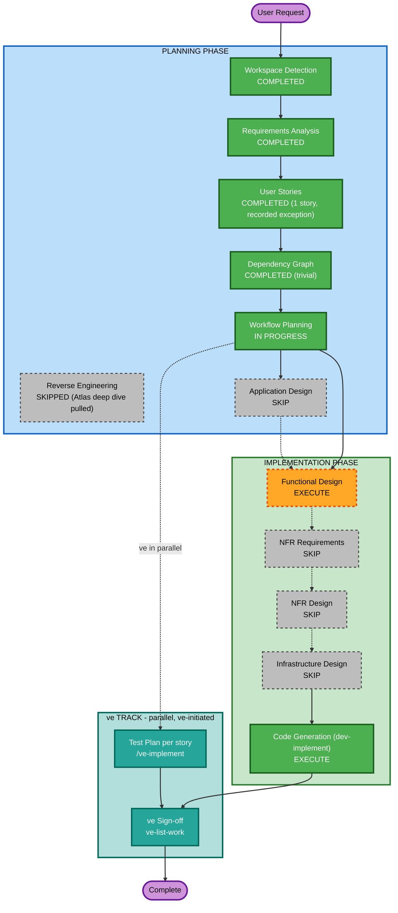

# Execution Plan — Self-Serve Premium Upgrade

## Detailed Analysis Summary

### Transformation Scope (Brownfield)
- **Transformation Type**: Single component change (extends two existing files: `src/backend/main.py`, `src/frontend/src/pages/Billing.jsx`) — not an architectural transformation.
- **Primary Changes**: One new backend endpoint (`POST /api/billing/upgrade`, with a `dry_run` mode) and one new UI flow (CTA -> confirmation panel -> commit) on the existing Billing page.
- **Related Components**: `AuthContext.jsx` (read-only reuse of the existing email-token pattern, no changes), `App.css` (new styles for the button/badge/panel).

### Change Impact Assessment
- **User-facing changes**: Yes — new button, confirmation panel, and plan-badge state on the Billing page.
- **Structural changes**: No — no new architectural layers, no new services, no new modules.
- **Data model changes**: No new persistent schema (still in-memory dicts); `billing_data`/`users` entries gain new field VALUES (Premium limits) but no new field shapes.
- **API changes**: Yes — one new endpoint, `POST /api/billing/upgrade` (with `dry_run` query param).
- **NFR impact**: Yes — performance (<200ms), a deliberate, recorded auth-pattern-parity decision with a flagged Security Baseline risk (REQ-NF-02), and basic idempotency (REQ-NF-03). All already fully specified with concrete decisions in `spec/plans/requirements.md`.

### Component Relationships (Brownfield)
- **Primary Component**: `src/backend/main.py` (new endpoint), `src/frontend/src/pages/Billing.jsx` (new UI flow)
- **Infrastructure Components**: none
- **Shared Components**: `AuthContext.jsx` (read-only reuse), `App.css` (new classes)
- **Dependent Components**: none — no other page/service consumes the upgrade endpoint
- **Supporting Components**: none new

### Risk Assessment
- **Risk Level**: Medium — isolated to two files, but touches the system's only write path into shared in-memory state and inherits a known-critical auth pattern (accepted, recorded decision).
- **Rollback Complexity**: Easy — single story, single PR, no data migration.
- **Testing Complexity**: Moderate — proration math, idempotency, and 3 UI states (loading/success/error) all need coverage; zero pre-existing test infrastructure in the repo (Deep Dive finding), so this story also bootstraps the first unit tests.

## Workflow Visualization

## Phases to Execute

### PLANNING PHASE
- [x] Workspace Detection (COMPLETED)
- [x] Reverse Engineering (SKIPPED — Atlas deep dive found and pulled)
- [x] Requirements Analysis (COMPLETED)
- [x] User Stories (COMPLETED — 1 story, recorded exception to Step 18.6)
- [x] Dependency Graph (COMPLETED — trivial, no edges)
- [x] Execution Plan (this document)
- [ ] Application Design — **SKIP**
  - **Rationale**: The change is entirely within existing component boundaries (`main.py`, `Billing.jsx`). No new components, services, or service-layer design are introduced — one new endpoint on an existing monolithic file, one new UI flow on an existing page.

### IMPLEMENTATION PHASE
- [ ] Functional Design — **EXECUTE**
  - **Rationale**: A genuine new business rule needs detailed design before code generation — the proration formula, the `UpgradeRequest` request model, the Premium usage-limit mapping table, and the on-demand-balance carry-over semantics (REQ-F-05, REQ-F-06, REQ-F-07). This also produces the input `architecture.md` will consolidate into Section 10 Verifiable Constraints.
- [ ] NFR Requirements — **SKIP**
  - **Rationale**: NFRs are already fully specified with concrete decisions in `spec/plans/requirements.md` (REQ-NF-01..06) — response time target, the deliberate auth-pattern-parity decision (with its flagged Security Baseline risk), idempotency approach, and CORS. No new tech-stack selection is needed; the story deliberately reuses the existing stack and patterns.
- [ ] NFR Design — **SKIP**
  - **Rationale**: Depends on NFR Requirements, which is skipped. No new NFR patterns to incorporate — the story matches existing patterns by explicit decision (REQ-NF-02).
- [ ] Infrastructure Design — **SKIP**
  - **Rationale**: No infrastructure, deployment-model, or cloud-resource changes — pure application-code change to an existing local POC.
- [ ] Code Generation — **EXECUTE (ALWAYS)**
  - **Rationale**: Implementation planning and code generation are required for Story 1.1, triggered by `dev-implement`.

### ve TRACK (parallel — ve-initiated, NOT scheduled or executed by this workflow)
- Test Plan — run per story by ve with **`/ve-implement`**, in parallel with development
- ve Sign-off — run by ve with **`ve-list-work`** on the epic branch once the story PR merges
  - **Rationale**: Test Plan is not an Implementation-phase stage at epic or story level; not scheduled here, never auto-run.

## Package Change Sequence
N/A — single-package repo (`src/backend`, `src/frontend`), not a monorepo with independent packages.

## Estimated Timeline
- **Total Phases**: 3 remaining (Functional Design, Code Generation via `dev-implement`, then ve's parallel Test Plan)
- **Estimated Duration**: Small — single story, two files, no new architectural layers

## Success Criteria
- **Primary Goal**: Standard-plan users can self-serve upgrade to Premium mid-cycle with a correct prorated charge and zero regressions on the existing Billing page.
- **Key Deliverables**: `POST /api/billing/upgrade` (commit + dry_run), updated `Billing.jsx` UI flow, unit tests (this story also bootstraps the repo's first test suite), behavior spec (`spec/behavior/story-1.1.feature`).
- **Quality Gates**: D1-D7 static gates, unit coverage >= `unitTestCoverageMin`, behavior B1/B2/B3, J1 architecture >= `llmJudgeArchitectureScoreMin`, J2 security >= `llmJudgeSecurityScoreMin` (with the REQ-NF-02 recorded exception applied at the security review as a narrowly-scoped accepted-risk item, not a silent pass).
- **Integration Testing**: Manual regression check (AC-12) that all existing Billing page sections still render correctly post-upgrade.
