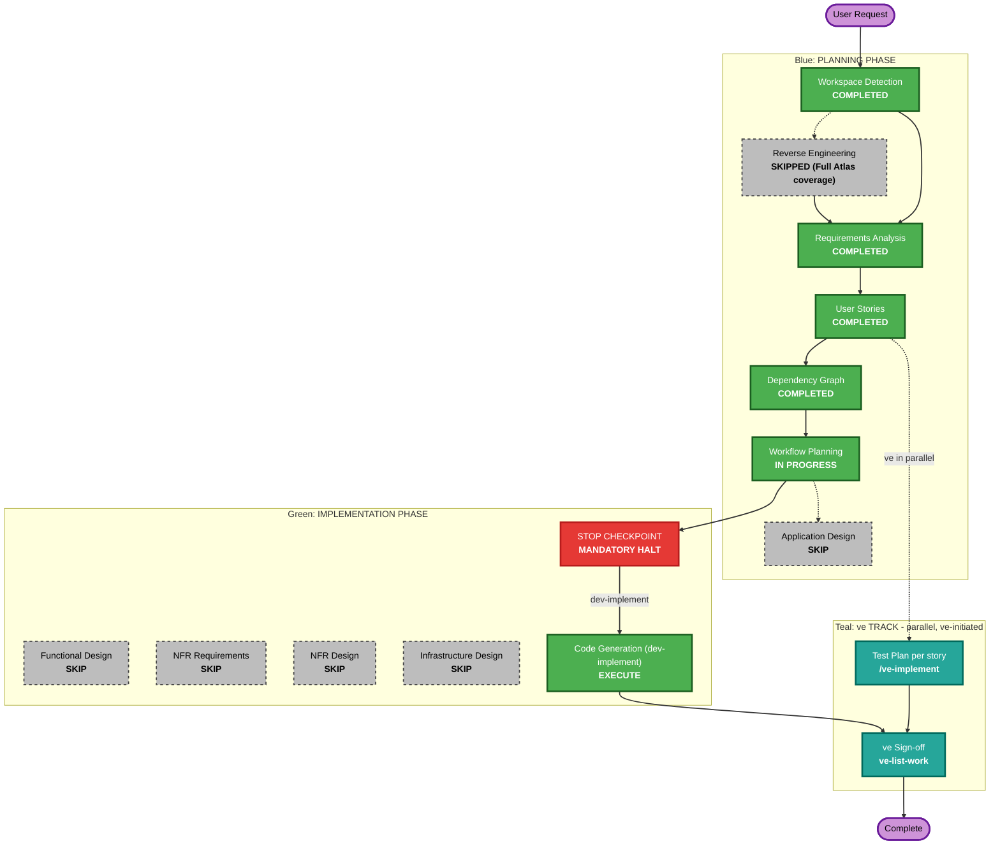

# Execution Plan

## Detailed Analysis Summary

### Transformation Scope (Brownfield)
- **Transformation Type**: Single component change — additive feature within the existing `backend/main.py` and `frontend/src/pages/Billing.jsx`, no new services/packages/deployment units.
- **Primary Changes**: 2 new FastAPI endpoints (`GET /api/billing/upgrade-preview`, `POST /api/billing/upgrade`), 1 new pure function (`charge_card`), 3 new backend constants; 1 modified frontend page (dynamic badge, CTA, confirmation modal, success/error handling).
- **Related Components**: None beyond the two files above — `AuthContext.jsx` (read-only reference for the email-as-token pattern), `App.jsx` route (unchanged).

### Change Impact Assessment
- **User-facing changes**: Yes — new CTA, modal, success banner, and inline error state on the Billing page.
- **Structural changes**: No — no new architectural layers, no new services, no routing changes.
- **Data model changes**: No new entities — extends the existing `billing_data`/`users` in-memory dict shapes with values already fully specified in `requirements.md`/`stories.md` (no schema design needed).
- **API changes**: Yes — 2 new endpoints, fully specified (request/response shapes, status codes) in the approved requirements and story.
- **NFR impact**: Minor and already fully captured as REQ-NF-01..05 (server-side-only math, zero new dependencies, deterministic gateway, consistent error conventions, accepted in-memory-store limitation) — no open NFR question remains.

### Component Relationships (Brownfield)
- **Primary Component**: Billing feature (`backend/main.py` billing section + `frontend/src/pages/Billing.jsx`)
- **Infrastructure Components**: None (no DB, no new deployment target)
- **Shared Components**: None modified (`AuthContext.jsx` read-only)
- **Dependent Components**: None — no other page/module consumes the billing endpoints
- **Supporting Components**: None (no new monitoring/logging needed for a POC)

### Risk Assessment
- **Risk Level**: Low — isolated to one existing page and one existing backend module; no auth, infra, or cross-service impact; easy rollback (revert the single commit/PR).
- **Rollback Complexity**: Easy
- **Testing Complexity**: Simple — deterministic gateway makes both outcomes (success/decline) trivially reproducible for unit and manual testing.

## Workflow Visualization

## Phases to Execute

### PLANNING PHASE
- [x] Workspace Detection (COMPLETED)
- [x] Reverse Engineering (SKIPPED — Full Atlas coverage via Helix MCP)
- [x] Requirements Analysis (COMPLETED)
- [x] User Stories (COMPLETED — 1 story, user-overridden granularity)
- [x] Dependency Graph (COMPLETED — no dependencies, single story)
- [x] Workflow Planning (IN PROGRESS)
- [ ] Application Design - **SKIP**
  - **Rationale**: No new components or services; the work stays entirely within the existing `backend/main.py` and `Billing.jsx` component boundaries. Endpoint/function signatures are already fully specified in `stories.md`.

### IMPLEMENTATION PHASE
- [ ] Functional Design - **SKIP**
  - **Rationale**: The one piece of non-trivial business logic (proration formula) is already fully specified with exact formulas and a worked example in `requirements.md`/`stories.md` — no remaining design ambiguity.
- [ ] NFR Requirements - **SKIP**
  - **Rationale**: Tech stack is already fixed (existing FastAPI/React POC); all NFRs identified (REQ-NF-01..05) are already fully captured in `requirements.md` with no open question.
- [ ] NFR Design - **SKIP**
  - **Rationale**: NFR Requirements skipped — nothing to incorporate.
- [ ] Infrastructure Design - **SKIP**
  - **Rationale**: No infrastructure changes — in-memory store, no new deployment target, no new cloud resources.
- [ ] Code Generation - **EXECUTE (ALWAYS)**
  - **Rationale**: Implementation is required to deliver the epic; triggered per-story via `dev-implement` after the mandatory STOP CHECKPOINT.

### ve TRACK (parallel — ve-initiated, NOT planned or executed by this workflow)
- Test Plan — run per story by ve with `/ve-implement`, in parallel with development
- ve Sign-off — run by ve with `ve-list-work` on the epic branch once the story PR merges
  - **Rationale**: Test Plan is not an Implementation stage at epic or story level; it is not scheduled here and is never auto-run

## Package Change Sequence
Not applicable — single-repo, single-module POC (no multi-package coordination).

## Estimated Timeline
- **Total Phases Executing**: Workspace Detection, Requirements Analysis, User Stories, Dependency Graph, Workflow Planning, STOP Checkpoint (architecture.md + rubrics + CI), Code Generation (1 story)
- **Estimated Duration**: ~3.5 days of estimated effort per the Epic's own estimate (Story 1 consolidates the Epic's original 5-story, ~3.5-day estimate into one story)

## Success Criteria
- **Primary Goal**: Standard subscribers can self-serve upgrade to Premium mid-cycle with correct proration and a deterministic dummy payment outcome.
- **Key Deliverables**: 2 new backend endpoints, `charge_card()`, updated `Billing.jsx` (dynamic plan display, CTA, modal, success/error handling), unit tests, `architecture.md`, CI pipeline.
- **Quality Gates**: Unit + coverage, Gherkin behaviour spec (B1-B3), API & Contract Testing Gate (new endpoints), full regression vs baseline, static D1-D7, automated code review incl. Security Baseline diff-scoped review, blocking J1/J2 judge gates.
- **Integration Testing**: Manual verification of both `charge_card` outcomes (success / `fail*` email) end-to-end through the UI.
- **Operational Readiness**: N/A for this POC — no monitoring/alerting infrastructure exists or is being added.
